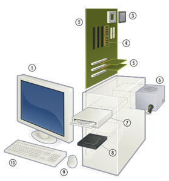
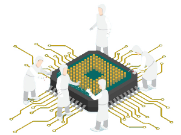
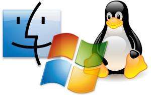
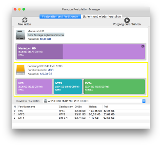

# 1️⃣ Instalación de Sistemas Operativos en Red

{align="right"}

En este primer tema, nos adentraremos en el proceso fundamental de instalación de sistemas operativos en red, una habilidad esencial para cualquier administrador de sistemas. La instalación de un sistema operativo en red no solo implica copiar archivos en un servidor; es un proceso que requiere una planificación meticulosa y un profundo entendimiento de las necesidades y características de la infraestructura de red.

Comenzaremos explorando la importancia del estudio de compatibilidad del sistema informático, asegurándonos de que el hardware y software seleccionados sean adecuados para las tareas que se pretenden realizar. A continuación, aprenderemos a diferenciar los distintos modos de instalación disponibles, así como a planificar y realizar el particionado del disco, seleccionando los sistemas de archivos más apropiados para optimizar el rendimiento y la seguridad del sistema.

Este tema también abordará la selección y configuración de los componentes del sistema operativo, incluyendo las herramientas para la automatización de instalaciones, que permiten reducir el tiempo y los errores asociados a las configuraciones manuales.

Finalmente, veremos cómo actualizar el sistema operativo en red para mantenerlo seguro y eficiente, y cómo verificar la conectividad entre el servidor y los equipos cliente, garantizando que todos los elementos de la red puedan comunicarse de manera efectiva.

Al concluir este tema, estaréis capacitados para realizar instalaciones de sistemas operativos en red de manera eficiente, asegurando que todos los componentes del sistema trabajen en armonía y cumplan con los requisitos de la organización.

## 1.1 Estudio de Compatibilidad del Sistema Informático

    

El estudio de compatibilidad del sistema informático es una fase crucial en la preparación para la instalación de un sistema operativo en red. Este paso asegura que el hardware seleccionado, así como los periféricos y componentes adicionales, sean compatibles con el sistema operativo elegido y que el conjunto funcione de manera eficiente una vez instalado. Este proceso involucra varios aspectos clave que deben ser revisados con detenimiento:

### 1.1.1 Requisitos del Sistema
Cada sistema operativo tiene unos requisitos mínimos y recomendados que deben cumplirse para que funcione correctamente. Estos requisitos suelen estar especificados en la documentación oficial del sistema operativo y se refieren a diversos aspectos del hardware, como:

|||
|-|-|
| | **Procesador (CPU)** El tipo y la velocidad del procesador son fundamentales. Los sistemas operativos modernos requieren procesadores de múltiples núcleos para manejar tareas simultáneas de manera eficiente. Es necesario verificar si el procesador soporta las instrucciones específicas que el sistema operativo podría necesitar, como la virtualización o el soporte para 64 bits.|

!!! note "Ejemplo de CPU"
    Un servidor que soporta Windows Server 2022 requiere, al menos, un procesador con una frecuencia de 1.4 GHz para instalaciones básicas, aunque se recomienda un procesador con varios núcleos y velocidades más altas para tareas más intensivas.

|||
|-|-|
|| **Memoria RAM** La cantidad de RAM es crítica, ya que afecta directamente al rendimiento del sistema. Un sistema operativo en red que gestiona múltiples conexiones simultáneas y ejecuta varios servicios en segundo plano necesita una cantidad considerable de memoria para funcionar sin problemas.|

!!! abstract "Ejemplo de RAM"
    Para la instalación de Ubuntu Server 22.04, el requisito mínimo es 512 MB de RAM, pero para un rendimiento óptimo y si se planea ejecutar servicios adicionales, se recomienda al menos 2 GB o más.

|||
|-|-|
|| **Espacio en Disco** El espacio en disco no solo debe ser suficiente para la instalación del sistema operativo, sino también para los archivos temporales, logs, y otros servicios que puedan necesitar almacenamiento adicional. Además, cuanto más rápido sea a la hora de leer y escribir datos, más fluido irá nuestro sistema.|

!!! info "Ejemplo de Espacio en Disco"
    Red Hat Enterprise Linux (RHEL) puede requerir más de 10 GB de espacio en disco para una instalación completa con entorno gráfico, pero si se instala en modo minimalista, puede necesitar considerablemente menos.

|||
|-|-|
|| **Tarjeta de Red (NIC)** La tarjeta de red (Network Interface Card) debe ser compatible con el sistema operativo para asegurar la conectividad. Algunos sistemas operativos incluyen controladores para una amplia gama de tarjetas de red, pero en otros casos, puede ser necesario descargar e instalar controladores adicionales.|

!!! tip "Ejemplo de NIC"
    Windows Server soporta una amplia gama de tarjetas de red, pero en entornos donde se utilizan tarjetas NIC especializadas, es importante verificar la compatibilidad y la disponibilidad de los controladores.

|||
|-|-|
|| **La compatibilidad con periféricos y componentes** Es crucial que otros componentes como discos duros, unidades de almacenamiento externas, impresoras, y otros periféricos sean compatibles con el sistema operativo.|

!!! success "Ejemplo de Compatibilidad con periféricos y componentes"
    Un servidor con discos duros SSD o controladoras RAID avanzadas puede requerir controladores específicos durante la instalación del sistema operativo. Incluso si es un periférico recién salido al mercado y el sistema operativo no está actualizado.

### 1.1.2 Compatibilidad de Hardware

{align="right"} 

Más allá de los requisitos básicos del sistema, se debe verificar la compatibilidad específica del hardware con el sistema operativo en red elegido.

La compatibilidad del hardware es crucial para evitar problemas como pérdida de datos, caídas de red, conflictos de dispositivos y baja eficiencia.

Un sistema en red con hardware incompatible puede experimentar dificultades para mantener conexiones estables, realizar transferencias de datos a la velocidad requerida, o incluso fallar en su funcionamiento básico.

La compatibilidad de hardware es un aspecto esencial a considerar antes de la instalación de un sistema operativo en red, ya que garantiza que todos los componentes del servidor funcionen de manera óptima y sin conflictos.

Una mala elección o configuración del hardware puede llevar a problemas de rendimiento, inestabilidad del sistema, o incluso la imposibilidad de completar la instalación.

Este apartado se centra en los aspectos clave a evaluar para asegurar que el hardware seleccionado sea completamente compatible con el sistema operativo en red que se va a instalar.

Por lo tanto, al diseñar o mantener un sistema en red, es esencial garantizar que todos los componentes de hardware sean compatibles entre sí y con el software y protocolos que se utilizan en la red.

Pero ¿cómo podemos verificar todo esto? 👇

---

#### 1.1.2.1 Lista de compatibilidad de Hardware (HCL)

{align="right"}
Los fabricantes de sistemas operativos suelen proporcionar una lista de compatibilidad de hardware (Hardware Compatibility List, HCL) que detalla todos los dispositivos y componentes que han sido probados y certificados para funcionar con su sistema operativo. Es recomendable consultar esta lista antes de la instalación.

Una Lista de Compatibilidad de Hardware (HCL, por sus siglas en inglés) es un recurso que los fabricantes de sistemas operativos proporcionan para ayudar a los administradores a seleccionar hardware que ha sido probado y certificado para funcionar correctamente con su sistema operativo. Consultar esta lista es el primer paso crucial para asegurar que todo el hardware del servidor sea compatible.

- **Acceso a la HCL**: La mayoría de los fabricantes, como Microsoft para Windows Server, Red Hat para RHEL, o Canonical para Ubuntu Server, mantienen actualizadas estas listas en sus sitios web oficiales. La HCL incluye una lista detallada de procesadores, placas base, tarjetas de red, controladoras RAID, y otros dispositivos que han sido probados y se sabe que funcionan de manera estable con el sistema operativo.

!!! tip "Selección de hardware certificado"

{align="right"}

Al elegir hardware que figura en la HCL, se minimiza el riesgo de incompatibilidades y se asegura que el hardware y el sistema operativo trabajen juntos de manera eficiente. Esta lista también ofrece información sobre versiones específicas de firmware y controladores que son compatibles, lo que es crucial para la estabilidad del sistema.

  - **Ejemplo práctico** ➡️ Un administrador que planea instalar *Windows Server 2022* podría consultar la HCL de Microsoft para asegurarse de que el servidor *Dell PowerEdge R750*, incluyendo sus componentes como las tarjetas de red Broadcom y la controladora RAID PERC H755, son compatibles con *Windows Server 2022*. Al confirmar esta compatibilidad en la HCL, el administrador puede proceder con la instalación con mayor confianza.

!!! tip "Actualización de la HCL"

{align="right"}

Es importante tener en cuenta que la HCL se actualiza regularmente.

Nuevos componentes pueden ser añadidos, y en algunos casos, ciertos dispositivos pueden ser descontinuados o etiquetados como incompatibles debido a problemas identificados después de su lanzamiento.

Por lo tanto, es recomendable revisar la HCL antes de cada instalación, especialmente si se utilizan equipos nuevos o versiones actualizadas del sistema operativo.

---

#### 1.1.2.2 Verificación y Actualización de Controladores

{align="right"}

Los controladores son programas que permiten que el sistema operativo se comunique con el hardware.

La disponibilidad y actualización de los controladores son fundamentales para garantizar que los componentes del hardware funcionen de manera correcta y eficiente con el sistema operativo.

!!! danger "Importancia de los controladores actualizados"
    
Los controladores actualizados no solo garantizan que el hardware funcione, sino que también pueden mejorar el rendimiento, añadir nuevas funcionalidades y corregir errores o vulnerabilidades de seguridad. Por ejemplo, un controlador de tarjeta de red actualizado podría mejorar la velocidad de transmisión de datos o corregir un problema de desconexión intermitente.

!!! danger "Fuentes de controladores"

Los controladores pueden obtenerse del sitio web del fabricante del hardware o del sistema operativo. Es recomendable descargar la última versión del controlador compatible desde la página del fabricante antes de iniciar la instalación del sistema operativo.

  - **Ejemplo práctico en Linux** ➡️ Al instalar un sistema operativo Linux en un servidor que utiliza una tarjeta de red especializada, es posible que los controladores necesarios no estén incluidos en la distribución de Linux por defecto. En este caso, el administrador debe descargar el controlador desde el sitio web del fabricante de la tarjeta de red y seguir las instrucciones específicas para compilar e instalar el controlador en el sistema

!!! danger "Integración de controladores durante la instalación"

Algunos sistemas operativos permiten integrar controladores específicos durante la instalación. Esto es especialmente útil para hardware crítico como controladoras RAID o tarjetas de red, que deben estar operativas durante la instalación para que el sistema operativo pueda acceder al almacenamiento o a la red.

  - **Ejemplo práctico** ➡️ Durante la instalación de Windows Server, se puede usar la opción "Load Driver" (Cargar controlador) para agregar controladores de almacenamiento o red desde una unidad USB si el sistema operativo no los detecta automáticamente. Esto asegura que el servidor pueda acceder a los discos duros o a la red durante y después de la instalación.
  
!!! danger "Problemas comunes con controladores"

Algunos de los problemas más comunes relacionados con controladores incluyen la falta de controladores adecuados para dispositivos específicos, lo que puede causar que estos no funcionen correctamente o no sean reconocidos durante la instalación del sistema operativo. También es posible que versiones antiguas de controladores causen inestabilidad o incompatibilidades con versiones nuevas del sistema operativo.

#### 1.1.2.3 Compatibilidad de Firmware

{align="right"}

El firmware es un tipo de software interno que controla cómo interactúan los componentes de hardware con el sistema operativo.

A diferencia de los controladores, que son software que se ejecuta dentro del sistema operativo, el firmware se encuentra almacenado en chips dentro del hardware mismo.

Es fundamental asegurarse de que el firmware de todos los dispositivos críticos esté actualizado y sea compatible con el sistema operativo.

!!! question "Actualización del firmware"

Mantener el firmware actualizado es esencial para asegurar la compatibilidad con los últimos sistemas operativos y para corregir errores o mejorar el rendimiento del hardware. La actualización de firmware es un proceso que debe realizarse con cuidado, siguiendo las instrucciones del fabricante, ya que una actualización incorrecta puede dañar el hardware.

- Ejemplo en servidores ➡️ Los servidores a menudo dependen de un firmware sofisticado para la gestión del hardware, como las controladoras RAID o las interfaces de administración remota (por ejemplo, iDRAC en servidores Dell o iLO en servidores HP). Una actualización de firmware puede resolver problemas como incompatibilidades con nuevos discos duros o mejorar la estabilidad del sistema durante cargas de trabajo intensivas.

!!! question "Compatibilidad entre firmware y sistema operativo"

Es crucial que el firmware sea compatible con el sistema operativo. Esto incluye asegurarse de que la versión del firmware soporte las funciones avanzadas del sistema operativo, como la gestión avanzada de energía o la virtualización.

- Ejemplo en entornos virtualizados ➡️ En un entorno donde se planea utilizar la virtualización con un hipervisor como VMware ESXi o Microsoft Hyper-V, es esencial que el firmware de la CPU y la placa base soporte las tecnologías de virtualización como Intel VT-x o AMD-V. Sin este soporte, la virtualización no funcionará correctamente, limitando la capacidad del sistema para ejecutar múltiples máquinas virtuales.

!!! question "BIOS vs. UEFI"

La compatibilidad entre BIOS (Basic Input/Output System) o UEFI (Unified Extensible Firmware Interface) y el sistema operativo es otro aspecto crítico. UEFI es una versión más moderna y avanzada de BIOS que ofrece mejores opciones de seguridad, soporte para discos de gran tamaño (más de 2 TB), y un arranque más rápido. Muchos sistemas operativos modernos requieren UEFI para funcionar correctamente, especialmente si se utilizan características como el arranque seguro (Secure Boot).

- Ejemplo de migración ➡️ Al actualizar un servidor antiguo que usa BIOS a un nuevo sistema operativo que requiere UEFI, el administrador puede necesitar convertir el esquema de partición de MBR (Master Boot Record) a GPT (GUID Partition Table), lo cual puede implicar la reconfiguración del sistema de arranque y la partición del disco.

---

#### 1.1.2.4. Evaluación de Compatibilidad de Componentes Específicos

{align="right"}

Además de las consideraciones generales de compatibilidad, es necesario evaluar la compatibilidad de componentes específicos del servidor.

Estos componentes incluyen, pero no se limitan a, tarjetas de red, controladoras de almacenamiento, tarjetas gráficas, y otros dispositivos especializados que pueden ser críticos para el funcionamiento del servidor en un entorno de red.

!!! warning "Tarjetas de Red (NICs)"

Las tarjetas de red son esenciales para la conectividad en un entorno de red. Es vital asegurarse de que las tarjetas de red sean compatibles con el sistema operativo, tanto en términos de controladores disponibles como de soporte para características avanzadas como el balanceo de carga, VLANs (Redes de Área Local Virtuales), y otros servicios de red.

- Ejemplo práctico ➡️ Si se está instalando un sistema operativo Linux en un servidor que utiliza una tarjeta de red Intel con soporte para SR-IOV (Single Root I/O Virtualization), es importante verificar que el kernel de Linux soporte SR-IOV para aprovechar esta funcionalidad, que mejora el rendimiento en entornos virtualizados.

!!! warning "Controladoras de Almacenamiento"

Las controladoras RAID o de almacenamiento avanzado son otro componente crítico. La compatibilidad y el soporte de controladores para estas controladoras deben estar asegurados antes de la instalación del sistema operativo. Problemas en esta área pueden llevar a la pérdida de datos o a un acceso deficiente al almacenamiento.

- Ejemplo práctico ➡️ Al instalar Windows Server en un entorno que utiliza una controladora RAID avanzada como la PERC H755 de Dell, se debe confirmar que la controladora es reconocida durante la instalación y que los discos configurados en RAID son accesibles y funcionan correctamente.

!!! warning "Tarjetas Gráficas"

Aunque menos común en servidores, las tarjetas gráficas especializadas pueden ser necesarias en servidores que realizan tareas de procesamiento gráfico intensivo, como renderizado o computación en GPU. Es fundamental verificar la compatibilidad de estas tarjetas con el sistema operativo, especialmente si se utilizan drivers

---

## 1.2. Modos de Instalación de un Sistema Operativo en Red

    

La instalación de un sistema operativo en red es una tarea fundamental en la administración de sistemas, ya que afecta la configuración, rendimiento, y estabilidad de la infraestructura tecnológica. Existen varios modos de instalación, cada uno adecuado para diferentes escenarios, dependiendo de factores como el número de equipos, las características del hardware, y los requerimientos específicos de la organización.

### 1.2.1. Instalación Manual

La instalación manual es el método más básico y tradicional de instalación de un sistema operativo. Implica la intervención directa del administrador para llevar a cabo todo el proceso, desde el particionado del disco hasta la configuración de las opciones del sistema operativo. Este método es adecuado cuando se necesita instalar el sistema en un número limitado de equipos o cuando es necesario un alto grado de personalización.

`Preparación del entorno` 
Antes de iniciar la instalación, se requiere tener acceso a un medio de instalación, que puede ser un CD, DVD, o una unidad USB con el sistema operativo. También es importante verificar que el hardware sea compatible con el sistema que se va a instalar.

`Iniciar desde el medio de instalación` 
El servidor o equipo debe configurarse para arrancar desde el dispositivo de instalación. Esto generalmente se hace accediendo a la BIOS o UEFI para cambiar la secuencia de arranque.

`Particionado de discos` 
El administrador debe elegir cómo particionar los discos del equipo. Esto incluye la creación de particiones para el sistema operativo, archivos de intercambio, y particiones adicionales si es necesario.

`Selección de componentes y servicios` 
Durante la instalación manual, el administrador selecciona qué componentes y servicios del sistema operativo instalar, como servicios de red, servidores de archivos, o bases de datos.

`Configuración post-instalación` 
Una vez que el sistema operativo está instalado, se configura la red, los usuarios, los permisos, y otras preferencias personalizadas.

!!!note "Ventajas"
    - Control total 👉🏻 El administrador tiene el control absoluto sobre cada aspecto del proceso de instalación, permitiendo un alto grado de personalización.

    - Ideal para instalaciones únicas 👉🏻 Es adecuado para instalaciones en las que sólo se requiere configurar un número reducido de equipos, o en situaciones donde la instalación necesita personalización única.

!!!danger "Desventajas"
    - Tiempo 👉🏻 Es un proceso lento y laborioso, especialmente si se debe realizar en múltiples equipos.
    - Riesgo de error humano 👉🏻 Dado que el proceso es completamente manual, existe una mayor probabilidad de cometer errores, como un particionado incorrecto o una configuración errónea de los servicios.

!!!tip "Escenarios adecuados"
    - Instalación en servidores únicos que requieren configuraciones personalizadas.
    - Entornos de pruebas o laboratorios de aprendizaje.

### 1.2.2 Instalación Desatendida (Unattended Installation)

La instalación desatendida es una solución más automatizada que permite al administrador definir todas las opciones de instalación en un archivo de respuesta antes de iniciar el proceso.

Durante la instalación, el sistema operativo lee este archivo y se configura automáticamente sin intervención manual.

Este método es muy eficiente cuando se deben instalar múltiples sistemas con la misma configuración o cuando se quiere estandarizar la instalación en diferentes equipos. Pero ¿cómo es el proceso de instalación desatendida?

`Creación del archivo de respuesta` 
El administrador crea un archivo de respuesta que contiene las opciones de instalación, como el particionado del disco, la configuración de red, y los usuarios predeterminados. En sistemas **Windows**, por ejemplo, este archivo puede ser un archivo XML que sigue un esquema específico.

`Distribución del medio de instalación` 
El archivo de respuesta se incluye en el medio de instalación (USB, DVD, o red), de modo que, al iniciar el proceso de instalación, el sistema operativo lo lea automáticamente y proceda con los ajustes definidos.

`Ejecución de la instalación` 
La instalación se realiza sin intervención humana, utilizando las opciones del archivo de respuesta. El sistema se instalará de acuerdo con las preferencias predeterminadas y, al finalizar, estará listo para su uso.

!!!note "Ventajas"
    - Automatización y rapidez ➡️ Reduce significativamente el tiempo de instalación al no requerir intervención manual. Es ideal para grandes despliegues.
    
    - Estandarización ➡️ Permite la creación de instalaciones homogéneas en múltiples equipos, lo que es esencial para mantener la consistencia en grandes infraestructuras.

    - Menor probabilidad de errores ➡️ Al eliminar la intervención manual, se reduce el riesgo de errores durante el proceso de instalación.

!!!danger "Desventajas"
    - Menor flexibilidad ➡️ La personalización durante la instalación es limitada, ya que todas las configuraciones están predefinidas en el archivo de respuesta.
    
    - Requiere planificación previa ➡️ El archivo de respuesta debe ser configurado adecuadamente antes de la instalación, lo que puede requerir tiempo y planificación.

!!!tip "Escenarios adecuados"

    - Instalaciones masivas en entornos empresariales.
    - Organizaciones que requieren una configuración uniforme en múltiples servidores o estaciones de trabajo.

###  1.2.3. Instalación a través de la Red (PXE Boot)

La instalación a través de la red utiliza la tecnología PXE (Preboot Execution Environment) para arrancar un equipo desde la red y cargar un sistema operativo desde un servidor central.

En este caso, el medio de instalación no se requiere en cada equipo, ya que todos los archivos necesarios son descargados desde un servidor de instalación centralizado. Este método es común en grandes infraestructuras de IT, donde es necesario realizar despliegues masivos de sistemas operativos.

    Veamos cómo es el proceso de instalación a través de la red

`Configuración del servidor PXE` 
Se debe configurar un servidor PXE en la red, que contendrá la imagen de instalación del sistema operativo y gestionará las solicitudes de arranque de los equipos cliente.

`Arranque del equipo cliente` 
Los equipos cliente se configuran para arrancar desde la red mediante PXE. Al encenderse, estos envían una solicitud de arranque al servidor PXE.

`Descarga de la imagen de instalación` 
El servidor PXE responde con una imagen del sistema operativo y un archivo de arranque que permite al equipo cliente iniciar el proceso de instalación.

`Instalación del sistema operativo` 
Una vez descargada la imagen, la instalación procede de manera similar a otros métodos, con o sin intervención manual, dependiendo de la configuración.

!!!note "Ventajas"
    - No requiere medios físicos 🤜🏻 Elimina la necesidad de preparar y distribuir medios físicos de instalación (como CDs o USBs) en cada equipo.
    
    - Ideal para grandes infraestructuras 🤜🏻 Permite instalar sistemas operativos en múltiples equipos simultáneamente, lo que lo convierte en una excelente opción para empresas con cientos o miles de equipos.
    - Centralización 🤜🏻 La instalación se gestiona desde un servidor central, facilitando la administración y el mantenimiento de las imágenes de instalación.

!!!danger "Desventajas"

    - Dependencia de la red  🤜🏻 Este método depende completamente de la red. Si hay problemas de conectividad o ancho de banda limitado, la instalación puede ser lenta o fallar.
    - Configuración compleja 🤜🏻 Configurar un servidor PXE y mantener las imágenes de instalación puede ser más complicado que otros métodos.

!!!tip "Escenarios adecuados"
    - Instalación de sistemas operativos en empresas con grandes cantidades de equipos.
    
    - Despliegues masivos en centros de datos.
    
    - Instalación remota en oficinas distribuidas sin acceso físico a los equipos.

### 1.2.4. Clonación de Imágenes de Sistemas Operativos

La clonación de imágenes es un método en el que se crea una copia exacta de un sistema operativo ya instalado y configurado. Esta imagen se puede replicar en otros equipos, lo que permite una instalación rápida y homogénea.

Las herramientas como Clonezilla, Acronis o Norton Ghost son comúnmente utilizadas para realizar este tipo de instalaciones.

    Proceso de Clonación

`Preparación de la imagen` 
El administrador instala y configura un sistema operativo en un equipo "modelo". Este equipo debe tener la configuración y el software deseado para ser replicado.

`Creación de la imagen` 
Utilizando una herramienta de clonación, se crea una imagen exacta del disco duro del equipo modelo, incluyendo el sistema operativo, las configuraciones y las aplicaciones instaladas.

`Distribución de la imagen` 
Esta imagen se distribuye a otros equipos a través de medios físicos (USB, DVD) o a través de la red.

`Restaurar la imagen en otros equipos` 
Cada equipo recibe la imagen y la carga en su disco duro, replicando la instalación original.

!!!tip "Ventajas"
    - Rapidez ▶️ La clonación de imágenes es extremadamente rápida, ya que copia todo el sistema en una única operación.
    - Estandarización ▶️ Todos los equipos reciben exactamente la misma configuración, garantizando uniformidad.
    - Ideal para grandes despliegues ▶️ Es una excelente opción para implementar rápidamente el mismo sistema operativo en múltiples equipos.

!!!danger "Desventajas"
    - Problemas de hardware ▶️ La imagen debe ser compatible con el hardware de todos los equipos. Si el hardware difiere significativamente, puede haber problemas de compatibilidad, especialmente con controladores

## 1.3 Particionado de Discos y Selección de Sistemas de Archivos

{align="right"}

El particionado de discos y la selección del sistema de archivos son etapas cruciales durante la instalación de un sistema operativo en red. Estas decisiones influyen directamente en el rendimiento, la seguridad y la organización de los datos del sistema.

Una correcta planificación del particionado y la elección adecuada del sistema de archivos aseguran que el servidor sea eficiente y fácil de mantener, y que pueda escalar según las necesidades de la red.

### 1.3.1. Particionado de Discos

El particionado es el proceso de dividir un disco físico en secciones lógicas llamadas particiones.

Cada partición puede funcionar como si fuera un disco separado, permitiendo gestionar diferentes sistemas operativos o separar datos del sistema en áreas distintas para optimizar el rendimiento o la seguridad.

    Tipos de particiones
Existen varios tipos de particiones que se pueden utilizar en el particionado de discos, cada uno con sus características específicas:

{==Partición primaria==} 
Es una de las cuatro particiones principales que se pueden crear en un disco con el sistema de particionamiento MBR (Master Boot Record). Una de estas particiones primarias puede contener un sistema operativo y es donde suele alojarse el cargador de arranque.

{==Partición secundaria o extendida==} 
Si se necesitan más de cuatro particiones, una de las particiones primarias puede convertirse en una partición extendida. Dentro de esta partición se pueden crear particiones lógicas adicionales. Esto es útil cuando se requiere más flexibilidad en el número de particiones.

{==Particiones lógicas==} 
Son particiones que se crean `dentro de una partición extendida`. En un disco, se puede tener un número ilimitado de particiones lógicas. En muchos servidores, los administradores crean varias particiones lógicas para organizar datos y mejorar el rendimiento del sistema.

    Estructura recomendada de particiones

El particionado adecuado de un disco debe estar alineado con el uso esperado del sistema y la cantidad de espacio en disco disponible. A continuación se presentan las particiones más comunes en servidores de red:

{==Partición del sistema operativo==} 
Se suele reservar una partición exclusiva para el sistema operativo. Esto permite que, en caso de que sea necesario reinstalar el sistema, los datos del servidor no se vean afectados. El tamaño de esta partición dependerá del sistema operativo instalado y los servicios que deba gestionar.

{==Partición de intercambio (swap)==} ➡️ Solo disponible en sistemas Linux 
El intercambio es un espacio en disco utilizado por el sistema operativo para extender la memoria física del servidor cuando la RAM se llena. El tamaño recomendado de esta partición depende de la cantidad de RAM disponible, pero generalmente es entre 1 y 2 veces la cantidad de memoria RAM.

{==Particiones de datos==} 
En servidores, es común crear particiones específicas para datos, como los que almacena el servidor de archivos o las bases de datos. Separar los datos del sistema operativo puede mejorar el rendimiento y facilitar la administración de backups.

{==Partición de registros/logs==} 
Para mejorar el control sobre el sistema y prevenir problemas, se puede dedicar una partición a los registros del sistema (/var/log en sistemas Linux). De esta manera, si los registros llenan la partición, no afectarán otras áreas del sistema.

{==Partición /home o /users (para perfiles de usuario)==} ➡️ Solo disponible en sistemas Linux 
En servidores donde los usuarios almacenan datos o perfiles personalizados, se puede dedicar una partición específica para esos perfiles, facilitando su mantenimiento y migración entre diferentes instalaciones.

!!!tip "Ventajas de un particionado adecuado"
    Mejor organización 👉🏻 Al dividir el sistema operativo, los datos y los logs en diferentes particiones, se facilita la gestión de estos elementos.

!!!danger "Seguridad y mantenimiento"
    Las particiones separadas permiten reinstalar o actualizar el sistema operativo sin perder datos importantes. También limita el impacto de ciertos tipos de errores o fallos en el sistema.

!!!note "Optimización del rendimiento"
    El particionado adecuado permite asignar sistemas de archivos y configuraciones de acceso optimizadas para diferentes tipos de uso, lo que mejora el rendimiento general del servidor.

### 1.3.2. Selección de Sistemas de Archivos

{align="right"}

El sistema de archivos es la estructura que utiliza un sistema operativo para gestionar y organizar los datos almacenados en un disco.

Cada sistema operativo puede ofrecer diferentes sistemas de archivos, y la elección del sistema adecuado depende de factores como el tipo de datos, el rendimiento esperado, la compatibilidad y las características específicas de cada sistema de archivos.

    Sistemas de archivos más comunes

{==NTFS (New Technology File System)==} ➡️ Windows

| 👌🏻 Ventajas ||
| ------------- | -------------- |
| Seguridad avanzada | Soporta permisos de archivos detallados y cifrado de datos |
| Journaling | Registro de cambios en el sistema de archivos, lo que protege contra pérdida de datos en caso de fallos |
| Compresión | Permite comprimir archivos para ahorrar espacio en disco |
| Soporte para archivos grandes | Soporta archivos individuales de hasta 16 TB |
 

| 👎🏻 Desventajas ||
| ------------ | --------------- |
| Compatibilidad limitada | Aunque Linux y otros sistemas operativos pueden leer y escribir en NTFS, no es el sistema de archivos nativo de estas plataformas |
| Sobrecarga de recursos | Requiere más recursos del sistema que otros sistemas de archivos, lo que puede afectar el rendimiento |

{==ext4 (Fourth Extended File System)==} ➡️ Linux

| 👌🏻 Ventajas ||
| ---------- | ----------------- |
| Journaling | Como NTFS, ext4 utiliza journaling, lo que ayuda a prevenir la corrupción de datos |
| Alto rendimiento | ext4 está optimizado para grandes volúmenes de datos y ofrece un rendimiento sólido para sistemas de servidores |
| Soporte de grandes volúmenes | Puede manejar particiones de hasta 1 exabyte y archivos de hasta 16 terabytes |
| Compatibilidad con Linux | Es el sistema de archivos nativo de la mayoría de las distribuciones Linux, lo que facilita su integración |

| 👎🏻 Desventajas ||
| ---------- | ----------------- |
| Compatibilidad limitada con otros sistemas operativos | Aunque existen herramientas para leer ext4 en Windows, no es un sistema de archivos ampliamente soportado fuera de Linux |

{==XFS (Extended File System)==} ➡️ Linux para empresas y sistemas de alto rendimiento

| 👌🏻 Ventajas ||
| ---------- | ----------------- |
| Rendimiento superior en archivos grandes | XFS está optimizado para manejar grandes archivos y volúmenes de datos |
| Escalabilidad | Soporta sistemas de archivos extremadamente grandes y se comporta bien en servidores de alta carga |
| Recuperación rápida | En caso de fallo, XFS tiene mecanismos eficientes de recuperación |

| 👎🏻 Desventajas ||
| ---------- | ----------------- |
| Complejidad en la gestión | Aunque potente, XFS puede ser más complicado de gestionar en comparación con ext4 |
| Journaling más intensivo | El uso intensivo del journaling puede generar una mayor sobrecarga de recursos |

{==FAT32 (File Allocation Table 32)==} ➡️ Windows y dispositivos portátiles

| 👌🏻 Ventajas ||
| ---------- | ----------------- |
| Compatibilidad universal | FAT32 es compatible con casi todos los sistemas operativos, lo que lo hace ideal para dispositivos externos |

| 👎🏻 Desventajas ||
| ---------- | ----------------- |
| Tamaño de archivo limitado | FAT32 no puede manejar archivos de más de 4 GB ni particiones mayores a 8 TB, lo que lo hace inadecuado para servidores modernos |
| Falta de seguridad | No soporta permisos de archivos ni journaling, lo que lo convierte en un sistema de archivos inseguro para entornos de red |

{==ReFS (Resilient File System)==} ➡️ Windows Server

| 👌🏻 Ventajas ||
| ---------- | ----------------- |
| Alta resiliencia | ReFS está diseñado para evitar la corrupción de datos, incluso en volúmenes grandes |
| Optimizado para almacenamiento | Está diseñado para manejar grandes cantidades de datos y puede corregir errores de forma automática |
| Soporte de integridad de datos | Usa checksums para asegurarse de que los datos almacenados sean correctos y no se corrompan |

| 👎🏻 Desventajas ||
| ---------- | ----------------- |
| Limitaciones de compatibilidad | Solo disponible en versiones específicas de Windows Server y no tan compatible con otras plataformas como NTFS|

!!!tip "Factores a considerar en la selección del sistema de archivos"
    - **Compatibilidad**: El sistema de archivos debe ser compatible con el sistema operativo y los dispositivos de la red. Por ejemplo, NTFS es ideal para entornos Windows, mientras que ext4 es mejor para servidores Linux.

    - **Seguridad**: En entornos empresariales, la seguridad es crucial. Sistemas de archivos como NTFS y ReFS ofrecen mejores controles de acceso y cifrado de datos que FAT32.

    - **Rendimiento**: Algunos sistemas de archivos están optimizados para manejar grandes volúmenes de datos o archivos grandes (como XFS o ReFS), mientras que otros pueden ser más ligeros pero limitados en cuanto al tamaño de archivos y particiones.

    - **Tamaño del volumen y los archivos**: Sistemas de archivos como ext4 y XFS pueden manejar volúmenes y archivos muy grandes, lo que es importante en servidores con almacenamiento masivo.

    - **Recuperación ante fallos**: Sistemas de archivos con journaling, como NTFS y ext4, ofrecen mecanismos para proteger la integridad de los datos, lo que es esencial en servidores de misión crítica.

🚀 Resumiendo 🚀 la correcta planificación del particionado de discos y la elección del sistema de archivos son decisiones clave que determinan la estabilidad, seguridad y rendimiento de un sistema operativo en red. {==Un particionado mal gestionado==} o una elección inadecuada de sistemas de archivos puede resultar en pérdida de datos, problemas de rendimiento o dificultades para escalar el sistema.

### **1.4. Actualización de Sistemas Operativos en Red**

Actualizar un sistema operativo en red es un proceso fundamental para garantizar la seguridad, el rendimiento y la estabilidad del entorno de red. Las actualizaciones permiten corregir vulnerabilidades, mejorar el funcionamiento de los servicios y acceder a nuevas funcionalidades. A diferencia de los sistemas operativos de escritorio, los sistemas operativos en red, como Windows Server, Linux Server o macOS Server, suelen manejar infraestructuras críticas, lo que significa que las actualizaciones deben ser gestionadas con especial atención y planificación.

#### **1.4.1. Tipos de Actualizaciones**

Existen diferentes tipos de actualizaciones que se pueden aplicar a un sistema operativo en red. Cada una tiene una finalidad específica y varía en cuanto a su importancia y frecuencia:

!!!warning "Actualizaciones de seguridad"

Estas actualizaciones son críticas y deben aplicarse con regularidad. Están diseñadas para corregir vulnerabilidades en el sistema operativo que podrían ser explotadas por atacantes. No aplicar estas actualizaciones puede poner en riesgo toda la infraestructura de la red, lo que podría comprometer los datos y los servicios.

**Características:**
- Frecuencia: Frecuente (pueden liberarse varias veces al mes).
- Prioridad: Alta.
- Impacto: Generalmente bajo, pero puede requerir reinicios.

**Ejemplo:**
Una actualización de seguridad que corrige una vulnerabilidad en el protocolo SMB (Server Message Block), utilizado en el intercambio de archivos en la red.

!!!tip "Actualizaciones de rendimiento o estabilidad"

Este tipo de actualizaciones está destinado a mejorar el rendimiento general del sistema operativo o resolver errores que afectan su estabilidad. Son menos urgentes que las actualizaciones de seguridad, pero igualmente importantes para mantener el sistema operativo funcionando de manera eficiente.

**Características:**
- Frecuencia: Moderada (mensual o trimestral).
- Prioridad: Media.
- Impacto: Pueden requerir reinicios, pero su objetivo es mejorar la estabilidad del sistema.

**Ejemplo:**
Una actualización que corrige una fuga de memoria en un servicio del sistema que provoca un consumo elevado de recursos a lo largo del tiempo.

!!!note "Actualizaciones de características"
Estas actualizaciones añaden nuevas funcionalidades al sistema operativo o mejoran las existentes. Pueden incluir mejoras en las interfaces gráficas, nuevos servicios para la red o la compatibilidad con nuevas tecnologías. Las actualizaciones de características deben ser gestionadas con cautela, ya que a veces pueden provocar problemas de compatibilidad con el hardware o software existente.

**Características:**
- Frecuencia: Baja (anual o semestral).
- Prioridad: Baja a media.
- Impacto: Alto, ya que pueden requerir reinicios y reconfiguraciones. A veces puede cambiar la experiencia del usuario o del administrador del sistema.

**Ejemplo:**
Una actualización que agrega soporte para nuevas versiones del protocolo de virtualización o servicios de almacenamiento en red (NAS/SAN).

!!!danger "Actualizaciones críticas o urgentes"

Estas actualizaciones son liberadas cuando se detecta una amenaza importante o un error crítico en el sistema operativo. Suele ser necesario aplicarlas inmediatamente para evitar que el fallo afecte el funcionamiento del servidor o la seguridad de la red.

**Características:**
- Frecuencia: Muy variable (cuando se detecta un problema grave).
- Prioridad: Muy alta.
- Impacto: Puede requerir reinicios inmediatos, lo que puede causar una interrupción temporal del servicio.

**Ejemplo:**
Una actualización que corrige un fallo de seguridad explotado activamente por ciberdelincuentes (vulnerabilidad de día cero).

#### **1.4.2. Métodos de Actualización**

Actualizar un sistema operativo en red requiere una cuidadosa planificación. Existen diferentes enfoques para realizar actualizaciones, cada uno con sus ventajas e inconvenientes:

##### **1.4.2.1. Actualización manual**
En este método, el administrador del sistema descarga e instala manualmente las actualizaciones en el servidor. Aunque puede ser un proceso más controlado, también es más lento y propenso a errores si se realiza en múltiples servidores.

**Ventajas:**
- Control total del proceso de actualización.
- Se puede seleccionar qué actualizaciones aplicar y cuáles omitir.
  
**Desventajas:**
- Consumo de tiempo y recursos, especialmente en entornos grandes.
- Mayor riesgo de errores humanos en la instalación o configuración de las actualizaciones.

##### **1.4.2.2. Actualización automática**
Los sistemas operativos en red pueden configurarse para descargar e instalar actualizaciones de manera automática. Esto asegura que las actualizaciones críticas se apliquen sin la intervención del administrador, pero también puede causar interrupciones inesperadas si el servidor se reinicia sin previo aviso.

**Ventajas:**
- Garantiza que las actualizaciones se apliquen a tiempo, especialmente las de seguridad.
- Reduce la carga administrativa en entornos con muchos servidores.
  
**Desventajas:**
- Falta de control sobre el momento exacto en que se aplican las actualizaciones.
- Riesgo de reinicios inesperados que pueden interrumpir los servicios.

##### **1.4.2.3. Actualización programada**
Este método combina los beneficios de la actualización manual y automática. Los administradores pueden programar las actualizaciones para que se apliquen en momentos específicos, como durante las horas de menor actividad en la red o los fines de semana.

**Ventajas:**
- Control sobre cuándo se aplican las actualizaciones, minimizando el impacto en los servicios.
- Se pueden aplicar en horarios que no afecten a los usuarios.
  
**Desventajas:**
- Requiere planificación, lo que puede ser un problema en entornos donde las actualizaciones deben aplicarse con urgencia.
- Riesgo de retrasar actualizaciones críticas si no se gestionan bien los cronogramas.

##### **1.4.2.4. Actualización con servidores de pruebas**
En entornos grandes o críticos, es recomendable probar las actualizaciones en servidores de prueba antes de implementarlas en los servidores de producción. Esto permite identificar problemas de compatibilidad o fallos que puedan surgir a raíz de la actualización.

**Ventajas:**
- Reduce el riesgo de errores en los servidores de producción.
- Permite probar y ajustar las actualizaciones antes de implementarlas en toda la red.

**Desventajas:**
- Requiere recursos adicionales (servidores de prueba).
- Puede ralentizar el proceso de actualización si hay muchas pruebas que realizar.

#### **1.4.3. Procedimientos para la Actualización de Sistemas Operativos en Red**

El proceso de actualización de un sistema operativo en red debe seguir una serie de pasos para garantizar que se realice de manera controlada y sin afectar los servicios críticos. A continuación, se describen los pasos comunes en una actualización típica:

##### **1.4.3.1. Planificación y evaluación**
Antes de aplicar una actualización, es crucial analizar los cambios que esta implicará. El administrador debe evaluar el impacto potencial en los servicios y determinar si existen riesgos, como la incompatibilidad de hardware o software.

- **Revisión de las notas de la versión**: Leer cuidadosamente las notas de la actualización para comprender qué se corrige, qué se mejora y si hay riesgos conocidos.
- **Evaluación del sistema**: Verificar si el servidor y las aplicaciones instaladas son compatibles con la nueva versión.
  
##### **1.4.3.2. Respaldo de la configuración y los datos**
Antes de aplicar cualquier actualización, se debe realizar una copia de seguridad completa del sistema, incluyendo la configuración del servidor y los datos críticos. Esto permite recuperar el sistema en caso de que algo salga mal durante la actualización.

- **Backups completos**: Respaldar no solo los archivos de datos, sino también las configuraciones y servicios clave (por ejemplo, la configuración del servidor de correo o la base de datos).
- **Verificación del backup**: Asegurarse de que las copias de seguridad son funcionales y se pueden restaurar.

##### **1.4.3.3. Aplicación de las actualizaciones**
Una vez realizada la planificación y el respaldo, se procede a la instalación de las actualizaciones. Este paso puede variar dependiendo del método seleccionado (manual, automático, programado).

- **Monitoreo del proceso**: Supervisar el progreso de la instalación para detectar errores o fallos tempranos.
- **Reinicio controlado**: Si es necesario un reinicio del sistema, debe hacerse en un momento que afecte lo menos posible a los usuarios y servicios.

##### **1.4.3.4. Verificación post-actualización**
Después de aplicar las actualizaciones, es fundamental verificar que el sistema operativo y los servicios de red estén funcionando correctamente.

- **Pruebas de conectividad**: Comprobar la conectividad de los equipos cliente con el servidor actualizado.
- **Comprobación de servicios**: Asegurarse de que todos los servicios críticos (correo, DNS, DHCP, etc.) están funcionando como se esperaba.
- **Revisión de logs**: Consultar los registros del sistema para detectar posibles errores o advertencias que hayan surgido durante el proceso de actualización.

##### **1.4.3.5. Documentación del proceso**
Por último, es importante documentar todo el proceso de actualización. Esto incluye las versiones de software instaladas, cualquier problema detectado y las soluciones aplicadas. La documentación será útil para futuras actualizaciones o en caso de necesitar restaurar el sistema.

#### **1.4.4. Desafíos Comunes en la Actualización de Sistemas Operativos en Red**

Actualizar sistemas operativos en red puede presentar diversos desafíos, especialmente en infraestructuras grandes o críticas. Algunos de los problemas más comunes incluyen:

-

 **Incompatibilidades de software o hardware**: Algunas actualizaciones pueden no ser compatibles con ciertos controladores o aplicaciones, lo que puede causar fallos de funcionamiento.
- **Interrupciones del servicio**: Si no se planifican adecuadamente, las actualizaciones pueden provocar cortes en el servicio, afectando la disponibilidad de la red.
- **Errores en la actualización**: A veces, las actualizaciones pueden fallar durante su aplicación, dejando el sistema en un estado inestable.
- **Dependencias no resueltas**: Algunas actualizaciones pueden requerir la instalación previa de otras actualizaciones o software, lo que puede complicar el proceso.

---

!!!tip "Conclusión"
    La actualización de sistemas operativos en red es una tarea fundamental que debe abordarse con cuidado y planificación. Mantener un sistema actualizado no solo garantiza la seguridad de la red, sino que también mejora el rendimiento y la estabilidad del entorno de trabajo. Los administradores de sistemas deben dominar los procedimientos adecuados para aplicar actualizaciones y estar preparados para resolver cualquier problema que pueda surgir durante el proceso.

### **1.5 Comprobación de la conectividad del servidor con los equipos cliente**

Una vez que el sistema operativo en red está instalado y configurado, es fundamental comprobar que la conectividad entre el servidor y los equipos cliente funciona correctamente. La conectividad entre estos elementos es esencial para que los servicios ofrecidos por el servidor (autenticación, gestión de archivos, aplicaciones, etc.) estén disponibles para los clientes.

#### **1.5.1 Verificación de la conectividad mediante herramientas de red**

Existen diversas herramientas que permiten comprobar si un servidor y sus clientes están comunicándose correctamente a través de la red:

`Ping`: El comando ping se utiliza para verificar si un cliente puede alcanzar el servidor en la red. Permite medir el tiempo de respuesta (latencia) y detectar si hay problemas en la conectividad.

`Ejemplo práctico`: ping 192.168.1.1 (donde 192.168.1.1 es la dirección IP del servidor).
Traceroute (tracert en Windows): Esta herramienta permite rastrear la ruta que siguen los paquetes de datos desde el cliente hasta el servidor. Es útil para detectar problemas en diferentes puntos de la red.

`Ejemplo práctico`: tracert 192.168.1.1.
Netstat: Permite visualizar las conexiones activas en el servidor y en los clientes, verificando qué puertos están abiertos y qué servicios están utilizando la red.

`Ejemplo práctico:` netstat -an.
Nslookup y Dig: Estas herramientas permiten verificar que los servidores DNS están funcionando correctamente y que los nombres de dominio pueden resolverse a direcciones IP.

`Ejemplo práctico:` nslookup servidor.local.

#### **1.5.2 Configuración de pruebas básicas de conectividad**

A continuación, se presentan los pasos básicos para comprobar que los equipos cliente y el servidor pueden comunicarse correctamente:

!!!warning "***Comprobación de la conectividad IP:***"

    Realizar un ping desde el cliente hacia la IP del servidor.
    Si el ping es exitoso, se puede decir que la conectividad a nivel de red está establecida.

***Pruebas con servicios específicos***

Si se ha configurado un servicio de archivos (por ejemplo, SMB), probar a acceder a los recursos compartidos desde un cliente.
Si se ha configurado Active Directory, probar a iniciar sesión en el dominio desde una máquina cliente.

➡️ Revisión de registros de eventos:

Utilizar el Visor de eventos para identificar posibles errores en los servicios o en la red, tanto en el servidor como en los equipos cliente.

!!!danger "Comprobación de los cortafuegos"

    Asegurarse de que los cortafuegos en los equipos cliente y el servidor permiten el tráfico de red necesario para los servicios que se están utilizando. Verificar las reglas del firewall en Windows Defender o en cualquier otro software de seguridad que esté instalado en el servidor.

#### **1.5.3 Resolución de problemas comunes de conectividad**

Algunos problemas comunes que pueden surgir durante la verificación de conectividad y las posibles soluciones:

⭕ ***Problemas de resolución de nombres***: Si los equipos cliente no pueden resolver el nombre del servidor, puede deberse a una configuración incorrecta del servidor DNS. Asegúrate de que los clientes están utilizando el DNS correcto y de que los registros DNS están correctamente configurados.

⭕ ***Direcciones IP incorrectas***: Verifica que tanto el servidor como los clientes tienen direcciones IP correctas y en la misma subred. Si se están utilizando direcciones IP automáticas, asegúrate de que el servidor DHCP está funcionando correctamente.

⭕ ***Problemas de configuración del cortafuegos***: A menudo, los cortafuegos pueden bloquear la comunicación entre el servidor y los clientes. Revisa las configuraciones del cortafuegos y asegúrate de que los puertos necesarios están abiertos para el tráfico de red.

⭕ ***Interrupciones en la red***: Si el ping a veces falla o la conectividad es intermitente, puede haber problemas físicos con los cables de red o los dispositivos de red (switches, routers). Comprueba el hardware y la estabilidad de la red.

### **1.6 Automatización de instalaciones**

La automatización del proceso de instalación es una práctica común en entornos empresariales para reducir el tiempo y el esfuerzo manual necesarios en la configuración de múltiples servidores o estaciones de trabajo.

#### **1.6.1 Archivos de respuesta y scripts de instalación**

La mayoría de los sistemas operativos en red permiten la instalación desatendida mediante el uso de archivos de respuesta o scripts de instalación, los cuales incluyen las respuestas a las preguntas que normalmente se hacen durante la instalación interactiva. Este método es útil cuando se necesita instalar el sistema operativo en varios servidores o estaciones de trabajo con configuraciones similares.

***Archivos de respuesta***: Son documentos de texto o XML que contienen las configuraciones predefinidas para una instalación. En el caso de Windows Server, estos archivos son generados por la herramienta Windows System Image Manager (WSIM).

Ejemplo de parámetros en un archivo de respuesta:

    🟨 Configuración del disco duro (particionado).

    🟨 Selección de sistema de archivos.

    🟨 Configuración de red (IP estática).

    🟨 Nombre del equipo y configuración regional.

    🟨 Scripts de instalación en Linux: En sistemas operativos Linux, la automatización
    se puede lograr utilizando scripts kickstart (en Red Hat y derivados)
    o preseed (en Debian y derivados). Estos scripts contienen todas las instrucciones
    para realizar la instalación de forma automática y sin intervención del usuario.

#### **1.6.2 Implementación de plantillas de virtualización**

En entornos de virtualización, una técnica común para automatizar la instalación de sistemas operativos en red es utilizar plantillas. Una plantilla es una máquina virtual base que ya tiene el sistema operativo y las configuraciones iniciales instaladas. A partir de esta plantilla, se pueden clonar nuevas máquinas virtuales con rapidez.

!!!top "Ventajas de las plantillas:"

    🟨 Permiten desplegar servidores rápidamente.

    🟨 Garantizan uniformidad en las configuraciones.

    🟨 Reducen errores en la configuración manual.

    🟨 Gestión de plantillas en VirtualBox y otros entornos: Los entornos de virtualización
    como VirtualBox, VMware o Hyper-V permiten gestionar estas plantillas y clonar nuevas
    máquinas virtuales con facilidad. Estas herramientas permiten que los administradores
    desplieguen rápidamente nuevos servidores o estaciones de trabajo con configuraciones
    predefinidas.

#### **1.6.3 Ventajas de la automatización de instalaciones**

Entre las principales ventajas de la automatización de instalaciones se encuentran:

🟩 Ahorro de tiempo: Al no tener que realizar todas las configuraciones manualmente, se reduce considerablemente el tiempo necesario para instalar sistemas operativos en múltiples servidores.

🟩 Reducción de errores humanos: Al utilizar configuraciones predefinidas y probadas, se minimiza la posibilidad de errores durante la instalación.

🟩 Despliegue en masa: Permite realizar despliegues masivos de servidores o estaciones de trabajo de manera rápida y eficiente.

---

!!!note "Conclusión del Tema 1"
    En este tema, se han abordado los aspectos fundamentales relacionados con la instalación de sistemas operativos en red. Hemos visto cómo preparar el entorno antes de la instalación, los modos de instalación posibles (manual, desatendida, basada en red), cómo particionar discos y elegir el sistema de archivos adecuado, la importancia de mantener el sistema actualizado, y la verificación de la conectividad con los equipos cliente.

    Además, se ha explorado el uso de herramientas para la automatización de instalaciones, una técnica crucial en entornos empresariales para garantizar la consistencia y reducir el tiempo de configuración. Estos conocimientos proporcionan una base sólida para gestionar infraestructuras de red eficientes y seguras.

    A lo largo del desarrollo de estos conceptos, el objetivo ha sido que los alumnos comprendan tanto los aspectos técnicos como las mejores prácticas que deben aplicar a la hora de instalar y configurar sistemas operativos en red en entornos profesionales.

---

## 📚 Ejercicios

<i style="color: grey; text-decoration: line-through; opacity: 0.5;">🔰 101. Definir Requisitos de Hardware.
Explica los requisitos mínimos y recomendados de hardware para instalar el sistema operativo Windows Server 2022. Incluye especificaciones de procesador, memoria RAM, y espacio en disco.

🔰 102. HCL de Hardware: Investiga y describe qué es una Lista de Compatibilidad de Hardware (HCL) y por qué es importante consultarla antes de la instalación de un sistema operativo en red.

🔰 103. Comparativa de Controladores: Compara y contrasta los diferentes métodos para obtener controladores para un sistema operativo Windows y uno Linux. ¿Qué diferencias hay en el proceso de obtención y actualización de controladores?

🔰 104. Firmware y su Importancia: Describe el papel del firmware en un sistema informático. ¿Cómo afecta una versión desactualizada del firmware a la instalación de un sistema operativo?

🔰 105. Compatibilidad BIOS vs. UEFI: Explica las diferencias entre BIOS y UEFI. ¿Qué ventajas ofrece UEFI sobre BIOS para la instalación de sistemas operativos modernos?

🔰 106. Documentación Técnica: ¿Cómo interpretar la documentación técnica de un sistema operativo para verificar la compatibilidad del hardware? Proporciona un ejemplo de cómo se realiza esta interpretación.

🔰 107. Evaluación de Componentes Específicos: Enumera los componentes de hardware críticos en un servidor y discute por qué es importante verificar su compatibilidad con el sistema operativo antes de la instalación.

🔰 108. Proceso de Actualización de Controladores: Describe el proceso de actualización de controladores en un sistema operativo Linux. ¿Qué herramientas y comandos se utilizan para este propósito?

🔰 109. Pruebas de Compatibilidad: ¿Qué tipos de pruebas de compatibilidad se pueden realizar antes de la instalación de un sistema operativo en un nuevo hardware? Enumera y explica al menos tres tipos de pruebas.

🔰 110. Problemas de Compatibilidad Comunes: Identifica y explica tres problemas comunes de compatibilidad que pueden surgir durante la instalación de un sistema operativo y cómo se pueden prevenir o resolver.</i>

🔰 111. Windows 2022 Server ➡️ [Descarga los ejercicios](assets/windows-2022-ejercicios.html)