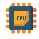

# 1️⃣ Instalación de Sistemas Operativos en Red

{align="right"}

En este primer tema, nos adentraremos en el proceso fundamental de instalación de sistemas operativos en red, una habilidad esencial para cualquier administrador de sistemas. La instalación de un sistema operativo en red no solo implica copiar archivos en un servidor; es un proceso que requiere una planificación meticulosa y un profundo entendimiento de las necesidades y características de la infraestructura de red.

Comenzaremos explorando la importancia del estudio de compatibilidad del sistema informático, asegurándonos de que el hardware y software seleccionados sean adecuados para las tareas que se pretenden realizar. A continuación, aprenderemos a diferenciar los distintos modos de instalación disponibles, así como a planificar y realizar el particionado del disco, seleccionando los sistemas de archivos más apropiados para optimizar el rendimiento y la seguridad del sistema.

Este tema también abordará la selección y configuración de los componentes del sistema operativo, incluyendo las herramientas para la automatización de instalaciones, que permiten reducir el tiempo y los errores asociados a las configuraciones manuales.

Finalmente, veremos cómo actualizar el sistema operativo en red para mantenerlo seguro y eficiente, y cómo verificar la conectividad entre el servidor y los equipos cliente, garantizando que todos los elementos de la red puedan comunicarse de manera efectiva.

Al concluir este tema, estaréis capacitados para realizar instalaciones de sistemas operativos en red de manera eficiente, asegurando que todos los componentes del sistema trabajen en armonía y cumplan con los requisitos de la organización.

## 1.1 Estudio de Compatibilidad del Sistema Informático

    

El estudio de compatibilidad del sistema informático es una fase crucial en la preparación para la instalación de un sistema operativo en red. Este paso asegura que el hardware seleccionado, así como los periféricos y componentes adicionales, sean compatibles con el sistema operativo elegido y que el conjunto funcione de manera eficiente una vez instalado. Este proceso involucra varios aspectos clave que deben ser revisados con detenimiento:

### 1.1.1 Requisitos del Sistema
Cada sistema operativo tiene unos requisitos mínimos y recomendados que deben cumplirse para que funcione correctamente. Estos requisitos suelen estar especificados en la documentación oficial del sistema operativo y se refieren a diversos aspectos del hardware, como:

|||
|-|-|
| | **Procesador (CPU)** El tipo y la velocidad del procesador son fundamentales. Los sistemas operativos modernos requieren procesadores de múltiples núcleos para manejar tareas simultáneas de manera eficiente. Es necesario verificar si el procesador soporta las instrucciones específicas que el sistema operativo podría necesitar, como la virtualización o el soporte para 64 bits.|

!!! note "Ejemplo de CPU"
    Un servidor que soporta Windows Server 2022 requiere, al menos, un procesador con una frecuencia de 1.4 GHz para instalaciones básicas, aunque se recomienda un procesador con varios núcleos y velocidades más altas para tareas más intensivas.

|||
|-|-|
|| **Memoria RAM** La cantidad de RAM es crítica, ya que afecta directamente al rendimiento del sistema. Un sistema operativo en red que gestiona múltiples conexiones simultáneas y ejecuta varios servicios en segundo plano necesita una cantidad considerable de memoria para funcionar sin problemas.|

!!! abstract "Ejemplo de RAM"
    Para la instalación de Ubuntu Server 22.04, el requisito mínimo es 512 MB de RAM, pero para un rendimiento óptimo y si se planea ejecutar servicios adicionales, se recomienda al menos 2 GB o más.

|||
|-|-|
|| **Espacio en Disco** El espacio en disco no solo debe ser suficiente para la instalación del sistema operativo, sino también para los archivos temporales, logs, y otros servicios que puedan necesitar almacenamiento adicional. Además, cuanto más rápido sea a la hora de leer y escribir datos, más fluido irá nuestro sistema.|

!!! info "Ejemplo de Espacio en Disco"
    Red Hat Enterprise Linux (RHEL) puede requerir más de 10 GB de espacio en disco para una instalación completa con entorno gráfico, pero si se instala en modo minimalista, puede necesitar considerablemente menos.

|||
|-|-|
|| **Tarjeta de Red (NIC)** La tarjeta de red (Network Interface Card) debe ser compatible con el sistema operativo para asegurar la conectividad. Algunos sistemas operativos incluyen controladores para una amplia gama de tarjetas de red, pero en otros casos, puede ser necesario descargar e instalar controladores adicionales.|

!!! tip "Ejemplo de NIC"
    Windows Server soporta una amplia gama de tarjetas de red, pero en entornos donde se utilizan tarjetas NIC especializadas, es importante verificar la compatibilidad y la disponibilidad de los controladores.

|||
|-|-|
|| **La compatibilidad con periféricos y componentes** Es crucial que otros componentes como discos duros, unidades de almacenamiento externas, impresoras, y otros periféricos sean compatibles con el sistema operativo.|

!!! success "Ejemplo de Compatibilidad con periféricos y componentes"
    Un servidor con discos duros SSD o controladoras RAID avanzadas puede requerir controladores específicos durante la instalación del sistema operativo. Incluso si es un periférico recién salido al mercado y el sistema operativo no está actualizado.

### 1.1.2 Compatibilidad de Hardware

{align="right"} 

Más allá de los requisitos básicos del sistema, se debe verificar la compatibilidad específica del hardware con el sistema operativo en red elegido.

La compatibilidad del hardware es crucial para evitar problemas como pérdida de datos, caídas de red, conflictos de dispositivos y baja eficiencia.

Un sistema en red con hardware incompatible puede experimentar dificultades para mantener conexiones estables, realizar transferencias de datos a la velocidad requerida, o incluso fallar en su funcionamiento básico.

La compatibilidad de hardware es un aspecto esencial a considerar antes de la instalación de un sistema operativo en red, ya que garantiza que todos los componentes del servidor funcionen de manera óptima y sin conflictos.

Una mala elección o configuración del hardware puede llevar a problemas de rendimiento, inestabilidad del sistema, o incluso la imposibilidad de completar la instalación.

Este apartado se centra en los aspectos clave a evaluar para asegurar que el hardware seleccionado sea completamente compatible con el sistema operativo en red que se va a instalar.

Por lo tanto, al diseñar o mantener un sistema en red, es esencial garantizar que todos los componentes de hardware sean compatibles entre sí y con el software y protocolos que se utilizan en la red.

Pero ¿cómo podemos verificar todo esto? 👇 

---

#### 1.1.2.1 Lista de compatibilidad de Hardware (HCL)

{align="right"}
Los fabricantes de sistemas operativos suelen proporcionar una lista de compatibilidad de hardware (Hardware Compatibility List, HCL) que detalla todos los dispositivos y componentes que han sido probados y certificados para funcionar con su sistema operativo. Es recomendable consultar esta lista antes de la instalación.

Una Lista de Compatibilidad de Hardware (HCL, por sus siglas en inglés) es un recurso que los fabricantes de sistemas operativos proporcionan para ayudar a los administradores a seleccionar hardware que ha sido probado y certificado para funcionar correctamente con su sistema operativo. Consultar esta lista es el primer paso crucial para asegurar que todo el hardware del servidor sea compatible.

- **Acceso a la HCL**: La mayoría de los fabricantes, como Microsoft para Windows Server, Red Hat para RHEL, o Canonical para Ubuntu Server, mantienen actualizadas estas listas en sus sitios web oficiales. La HCL incluye una lista detallada de procesadores, placas base, tarjetas de red, controladoras RAID, y otros dispositivos que han sido probados y se sabe que funcionan de manera estable con el sistema operativo.

!!! tip "Selección de hardware certificado"

{align="right"}

Al elegir hardware que figura en la HCL, se minimiza el riesgo de incompatibilidades y se asegura que el hardware y el sistema operativo trabajen juntos de manera eficiente. Esta lista también ofrece información sobre versiones específicas de firmware y controladores que son compatibles, lo que es crucial para la estabilidad del sistema.

  - **Ejemplo práctico** ➡️ Un administrador que planea instalar *Windows Server 2022* podría consultar la HCL de Microsoft para asegurarse de que el servidor *Dell PowerEdge R750*, incluyendo sus componentes como las tarjetas de red Broadcom y la controladora RAID PERC H755, son compatibles con *Windows Server 2022*. Al confirmar esta compatibilidad en la HCL, el administrador puede proceder con la instalación con mayor confianza.

!!! tip "Actualización de la HCL"

{align="right"}

Es importante tener en cuenta que la HCL se actualiza regularmente.

Nuevos componentes pueden ser añadidos, y en algunos casos, ciertos dispositivos pueden ser descontinuados o etiquetados como incompatibles debido a problemas identificados después de su lanzamiento.

Por lo tanto, es recomendable revisar la HCL antes de cada instalación, especialmente si se utilizan equipos nuevos o versiones actualizadas del sistema operativo.

---

#### 1.1.2.2 Verificación y Actualización de Controladores

{align="right"}

Los controladores son programas que permiten que el sistema operativo se comunique con el hardware.

La disponibilidad y actualización de los controladores son fundamentales para garantizar que los componentes del hardware funcionen de manera correcta y eficiente con el sistema operativo.

!!! danger "Importancia de los controladores actualizados"
    
Los controladores actualizados no solo garantizan que el hardware funcione, sino que también pueden mejorar el rendimiento, añadir nuevas funcionalidades y corregir errores o vulnerabilidades de seguridad. Por ejemplo, un controlador de tarjeta de red actualizado podría mejorar la velocidad de transmisión de datos o corregir un problema de desconexión intermitente.

!!! danger "Fuentes de controladores"

Los controladores pueden obtenerse del sitio web del fabricante del hardware o del sistema operativo. Es recomendable descargar la última versión del controlador compatible desde la página del fabricante antes de iniciar la instalación del sistema operativo.

  - **Ejemplo práctico en Linux** ➡️ Al instalar un sistema operativo Linux en un servidor que utiliza una tarjeta de red especializada, es posible que los controladores necesarios no estén incluidos en la distribución de Linux por defecto. En este caso, el administrador debe descargar el controlador desde el sitio web del fabricante de la tarjeta de red y seguir las instrucciones específicas para compilar e instalar el controlador en el sistema

!!! danger "Integración de controladores durante la instalación"

Algunos sistemas operativos permiten integrar controladores específicos durante la instalación. Esto es especialmente útil para hardware crítico como controladoras RAID o tarjetas de red, que deben estar operativas durante la instalación para que el sistema operativo pueda acceder al almacenamiento o a la red.

  - **Ejemplo práctico** ➡️ Durante la instalación de Windows Server, se puede usar la opción "Load Driver" (Cargar controlador) para agregar controladores de almacenamiento o red desde una unidad USB si el sistema operativo no los detecta automáticamente. Esto asegura que el servidor pueda acceder a los discos duros o a la red durante y después de la instalación.
  
!!! danger "Problemas comunes con controladores"

Algunos de los problemas más comunes relacionados con controladores incluyen la falta de controladores adecuados para dispositivos específicos, lo que puede causar que estos no funcionen correctamente o no sean reconocidos durante la instalación del sistema operativo. También es posible que versiones antiguas de controladores causen inestabilidad o incompatibilidades con versiones nuevas del sistema operativo.

#### 1.1.2.3 Compatibilidad de Firmware

{align="right"}

El firmware es un tipo de software interno que controla cómo interactúan los componentes de hardware con el sistema operativo.

A diferencia de los controladores, que son software que se ejecuta dentro del sistema operativo, el firmware se encuentra almacenado en chips dentro del hardware mismo.

Es fundamental asegurarse de que el firmware de todos los dispositivos críticos esté actualizado y sea compatible con el sistema operativo.

!!! question "Actualización del firmware"

Mantener el firmware actualizado es esencial para asegurar la compatibilidad con los últimos sistemas operativos y para corregir errores o mejorar el rendimiento del hardware. La actualización de firmware es un proceso que debe realizarse con cuidado, siguiendo las instrucciones del fabricante, ya que una actualización incorrecta puede dañar el hardware.

- Ejemplo en servidores ➡️ Los servidores a menudo dependen de un firmware sofisticado para la gestión del hardware, como las controladoras RAID o las interfaces de administración remota (por ejemplo, iDRAC en servidores Dell o iLO en servidores HP). Una actualización de firmware puede resolver problemas como incompatibilidades con nuevos discos duros o mejorar la estabilidad del sistema durante cargas de trabajo intensivas.

!!! question "Compatibilidad entre firmware y sistema operativo"

Es crucial que el firmware sea compatible con el sistema operativo. Esto incluye asegurarse de que la versión del firmware soporte las funciones avanzadas del sistema operativo, como la gestión avanzada de energía o la virtualización.

- Ejemplo en entornos virtualizados ➡️ En un entorno donde se planea utilizar la virtualización con un hipervisor como VMware ESXi o Microsoft Hyper-V, es esencial que el firmware de la CPU y la placa base soporte las tecnologías de virtualización como Intel VT-x o AMD-V. Sin este soporte, la virtualización no funcionará correctamente, limitando la capacidad del sistema para ejecutar múltiples máquinas virtuales.

!!! question "BIOS vs. UEFI"

La compatibilidad entre BIOS (Basic Input/Output System) o UEFI (Unified Extensible Firmware Interface) y el sistema operativo es otro aspecto crítico. UEFI es una versión más moderna y avanzada de BIOS que ofrece mejores opciones de seguridad, soporte para discos de gran tamaño (más de 2 TB), y un arranque más rápido. Muchos sistemas operativos modernos requieren UEFI para funcionar correctamente, especialmente si se utilizan características como el arranque seguro (Secure Boot).

- Ejemplo de migración ➡️ Al actualizar un servidor antiguo que usa BIOS a un nuevo sistema operativo que requiere UEFI, el administrador puede necesitar convertir el esquema de partición de MBR (Master Boot Record) a GPT (GUID Partition Table), lo cual puede implicar la reconfiguración del sistema de arranque y la partición del disco.

---

#### 1.1.2.4. Evaluación de Compatibilidad de Componentes Específicos

{align="right"}

Además de las consideraciones generales de compatibilidad, es necesario evaluar la compatibilidad de componentes específicos del servidor.

Estos componentes incluyen, pero no se limitan a, tarjetas de red, controladoras de almacenamiento, tarjetas gráficas, y otros dispositivos especializados que pueden ser críticos para el funcionamiento del servidor en un entorno de red.

!!! warning "Tarjetas de Red (NICs)"

Las tarjetas de red son esenciales para la conectividad en un entorno de red. Es vital asegurarse de que las tarjetas de red sean compatibles con el sistema operativo, tanto en términos de controladores disponibles como de soporte para características avanzadas como el balanceo de carga, VLANs (Redes de Área Local Virtuales), y otros servicios de red.

- Ejemplo práctico ➡️ Si se está instalando un sistema operativo Linux en un servidor que utiliza una tarjeta de red Intel con soporte para SR-IOV (Single Root I/O Virtualization), es importante verificar que el kernel de Linux soporte SR-IOV para aprovechar esta funcionalidad, que mejora el rendimiento en entornos virtualizados.

!!! warning "Controladoras de Almacenamiento"

Las controladoras RAID o de almacenamiento avanzado son otro componente crítico. La compatibilidad y el soporte de controladores para estas controladoras deben estar asegurados antes de la instalación del sistema operativo. Problemas en esta área pueden llevar a la pérdida de datos o a un acceso deficiente al almacenamiento.

- Ejemplo práctico ➡️ Al instalar Windows Server en un entorno que utiliza una controladora RAID avanzada como la PERC H755 de Dell, se debe confirmar que la controladora es reconocida durante la instalación y que los discos configurados en RAID son accesibles y funcionan correctamente.

!!! warning "Tarjetas Gráficas"

Aunque menos común en servidores, las tarjetas gráficas especializadas pueden ser necesarias en servidores que realizan tareas de procesamiento gráfico intensivo, como renderizado o computación en GPU. Es fundamental verificar la compatibilidad de estas tarjetas con el sistema operativo, especialmente si se utilizan drivers

---

## 1.2. Modos de Instalación de un Sistema Operativo en Red

La instalación de un sistema operativo en red es una tarea fundamental en la administración de sistemas, ya que afecta la configuración, rendimiento, y estabilidad de la infraestructura tecnológica. Existen varios modos de instalación, cada uno adecuado para diferentes escenarios, dependiendo de factores como el número de equipos, las características del hardware, y los requerimientos específicos de la organización.

### 1.2.1. Instalación Manual

La instalación manual es el método más básico y tradicional de instalación de un sistema operativo. Implica la intervención directa del administrador para llevar a cabo todo el proceso, desde el particionado del disco hasta la configuración de las opciones del sistema operativo. Este método es adecuado cuando se necesita instalar el sistema en un número limitado de equipos o cuando es necesario un alto grado de personalización.

#### 1.2.1.1. Proceso de Instalación Manual

    Preparación del entorno: Antes de iniciar la instalación, se requiere tener acceso a un medio de instalación, que puede ser un CD, DVD, o una unidad USB con el sistema operativo. También es importante verificar que el hardware sea compatible con el sistema que se va a instalar.
    Iniciar desde el medio de instalación: El servidor o equipo debe configurarse para arrancar desde el dispositivo de instalación. Esto generalmente se hace accediendo a la BIOS o UEFI para cambiar la secuencia de arranque.
    Particionado de discos: El administrador debe elegir cómo particionar los discos del equipo. Esto incluye la creación de particiones para el sistema operativo, archivos de intercambio, y particiones adicionales si es necesario.
    Selección de componentes y servicios: Durante la instalación manual, el administrador selecciona qué componentes y servicios del sistema operativo instalar, como servicios de red, servidores de archivos, o bases de datos.
    Configuración post-instalación: Una vez que el sistema operativo está instalado, se configura la red, los usuarios, los permisos, y otras preferencias personalizadas.

Ventajas

    Control total: El administrador tiene el control absoluto sobre cada aspecto del proceso de instalación, permitiendo un alto grado de personalización.
    Ideal para instalaciones únicas: Es adecuado para instalaciones en las que sólo se requiere configurar un número reducido de equipos, o en situaciones donde la instalación necesita personalización única.

Desventajas

    Tiempo: Es un proceso lento y laborioso, especialmente si se debe realizar en múltiples equipos.
    Riesgo de error humano: Dado que el proceso es completamente manual, existe una mayor probabilidad de cometer errores, como un particionado incorrecto o una configuración errónea de los servicios.

Escenarios adecuados

    Instalación en servidores únicos que requieren configuraciones personalizadas.
    Entornos de pruebas o laboratorios de aprendizaje.

## 📚 Ejercicios

 🔰 101. Definir Requisitos de Hardware.
Explica los requisitos mínimos y recomendados de hardware para instalar el sistema operativo Windows Server 2022. Incluye especificaciones de procesador, memoria RAM, y espacio en disco.

 🔰 102. HCL de Hardware: Investiga y describe qué es una Lista de Compatibilidad de Hardware (HCL) y por qué es importante consultarla antes de la instalación de un sistema operativo en red.

 🔰 103. Comparativa de Controladores: Compara y contrasta los diferentes métodos para obtener controladores para un sistema operativo Windows y uno Linux. ¿Qué diferencias hay en el proceso de obtención y actualización de controladores?

 🔰 104. Firmware y su Importancia: Describe el papel del firmware en un sistema informático. ¿Cómo afecta una versión desactualizada del firmware a la instalación de un sistema operativo?

 🔰 105. Compatibilidad BIOS vs. UEFI: Explica las diferencias entre BIOS y UEFI. ¿Qué ventajas ofrece UEFI sobre BIOS para la instalación de sistemas operativos modernos?

 🔰 106. Documentación Técnica: ¿Cómo interpretar la documentación técnica de un sistema operativo para verificar la compatibilidad del hardware? Proporciona un ejemplo de cómo se realiza esta interpretación.

 🔰 107. Evaluación de Componentes Específicos: Enumera los componentes de hardware críticos en un servidor y discute por qué es importante verificar su compatibilidad con el sistema operativo antes de la instalación.

 🔰 108. Proceso de Actualización de Controladores: Describe el proceso de actualización de controladores en un sistema operativo Linux. ¿Qué herramientas y comandos se utilizan para este propósito?

 🔰 109. Pruebas de Compatibilidad: ¿Qué tipos de pruebas de compatibilidad se pueden realizar antes de la instalación de un sistema operativo en un nuevo hardware? Enumera y explica al menos tres tipos de pruebas.

 🔰 110. Problemas de Compatibilidad Comunes: Identifica y explica tres problemas comunes de compatibilidad que pueden surgir durante la instalación de un sistema operativo y cómo se pueden prevenir o resolver.

 🔰 111. Consulta de HCL: Accede al sitio web del fabricante del sistema operativo (por ejemplo, Microsoft, Red Hat, Canonical) y localiza la HCL. Identifica al menos 6 componentes de hardware compatibles con el sistema operativo.

 🔰 112. Verificación de Controladores: Descarga los controladores más recientes para una tarjeta de red específica desde el sitio web del fabricante. Realiza la instalación en un entorno de prueba y verifica si el hardware funciona correctamente.

 🔰 113. Actualización de Firmware: Localiza y descarga la actualización de firmware para una controladora RAID en un servidor. Sigue el procedimiento recomendado por el fabricante para actualizar el firmware y verifica el estado del hardware después de la actualización.

 🔰 114. Configuración de BIOS/UEFI: Accede a la configuración de BIOS/UEFI en un servidor y cambia la configuración de arranque para habilitar el soporte UEFI si es necesario. Documenta los pasos realizados y los cambios efectuados.

 🔰 115. Simulación de Instalación: Utiliza una herramienta de virtualización (como VMware o VirtualBox) para simular la instalación de un sistema operativo en una configuración de hardware virtual. Observa y documenta cualquier problema de compatibilidad que aparezca durante la instalación.

 🔰 116. Comprobación de Requisitos del Sistema: Instala una herramienta de diagnóstico en un sistema para verificar que el hardware cumple con los requisitos del sistema operativo que se planea instalar. Genera un informe y verifica la compatibilidad.

 🔰 117. Prueba de Compatibilidad de Controladores en Linux: En un entorno Linux, instala una tarjeta de red que no esté incluida en el núcleo del sistema. Descarga e instala el controlador necesario, y verifica que la tarjeta de red esté operativa.

 🔰 118.Configuración de Periféricos: Instala y configura una impresora de red en un servidor y verifica que sea reconocida correctamente por el sistema operativo. Realiza una prueba de impresión para asegurar la funcionalidad completa.

 🔰 119. Evaluación de Compatibilidad del Hardware: Realiza una evaluación completa de un nuevo servidor para asegurar que todos los componentes (como CPU, memoria RAM, disco duro y tarjetas de expansión) sean compatibles con el sistema operativo en red. Documenta tus hallazgos.

 🔰 120. Verificación de Controladores en un Entorno Virtual: Crea un entorno virtual para probar la instalación de un sistema operativo en red. Asegúrate de que todos los controladores virtuales (para red, almacenamiento, etc.) sean compatibles y funcionen correctamente durante la instalación.