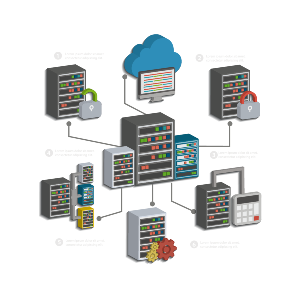

# 2️⃣ Windows 2019 Server Gestión de Usuarios y Grupos

{align="right"}

Vamos a preparar la configuración inicial de **Windows Server 2019** justo después del primer inicio de sesión. Este proceso incluye ajustes esenciales que todo servidor debe tener configurados antes de ser utilizado en un entorno de red, como la asignación de un nombre de servidor, la configuración de la red, y la instalación de roles y características.

## **1. Primer Inicio de Sesión**
Después de haber instalado Windows Server 2019 y reiniciado la máquina virtual, sigue estos pasos:

### **1.1. Iniciar sesión como Administrador**
1. En la pantalla de inicio de sesión, selecciona el usuario **Administrador**.
2. Introduce la contraseña que configuraste durante la instalación y pulsa **Enter**.
3. Windows Server iniciará y automáticamente se abrirá el **Administrador del servidor (Server Manager)**, que es la herramienta central para configurar y administrar el servidor.

## **2. Configuración Inicial del Servidor**

### **2.1. Configuración de la Zona Horaria**
1. En el **Administrador del servidor**, ve al lado superior derecho y haz clic en **"Local Server"** (Servidor Local).
   
2. En el panel de detalles, junto a la opción **"Time zone"** (Zona horaria), haz clic en el valor actual (por defecto será UTC).

3. En la ventana emergente, selecciona la zona horaria correcta según tu ubicación (por ejemplo, **"(UTC +1:00) Madrid"**) y haz clic en **OK**.

### **2.2. Cambiar el Nombre del Servidor**
El nombre del servidor debe ser algo descriptivo y único para facilitar la administración en red.

1. En **Servidor Local**, haz clic en el nombre del servidor actual junto a **"Computer Name"**.

2. Se abrirá la ventana de **Propiedades del sistema**. Haz clic en el botón **"Change"**.

3. En la ventana **Cambios en el nombre del equipo**, introduce el nuevo nombre en el campo **Computer Name** (por ejemplo, "SRV2019").

4. Haz clic en **OK** y acepta las advertencias. El sistema te pedirá que reinicies el servidor. Hazlo después de completar la siguiente sección sobre configuración de red.

### **2.3. Configurar la Dirección IP**
Para que el servidor pueda interactuar correctamente en una red, necesita tener una dirección IP estática.

1. En **Servidor Local**, en el apartado **Ethernet**, haz clic en el enlace al adaptador de red (probablemente "Ethernet 0").

2. Se abrirá la ventana de **Estado de Ethernet**. Haz clic en **Propiedades**.

3. Selecciona **Protocolo de Internet versión 4 (TCP/IPv4)** y haz clic en **Propiedades**.

4. Cambia la opción de **Obtener una dirección IP automáticamente** a **Usar la siguiente dirección IP** e introduce los siguientes valores según tu red:

   - **Dirección IP**: (por ejemplo, `192.168.1.100` o la IP que desees).
   - **Máscara de subred**: (por ejemplo, `255.255.255.0`).
   - **Puerta de enlace predeterminada**: (por ejemplo, `192.168.1.1`).

5. En **Servidores DNS**, introduce la dirección IP del servidor DNS de tu red o usa el DNS público de Google (`8.8.8.8`) o el de tu red.

6. Haz clic en **Aceptar** y cierra todas las ventanas.

### **2.4. Comprobar la Conectividad**
1. Abre **Símbolo del sistema** desde el menú de inicio.

2. Escribe el siguiente comando para verificar que el servidor tiene conectividad:

```bash
ping google.com
```

!!!note "Haciendo ping"
    Si obtienes respuestas, la configuración de red es correcta. Si no, revisa los pasos anteriores.

!!!danger "Cuidado"
    Puede ser que no obtengas respuesta haciendo ping ya que Consellería puede bloquear este comando. Asegurate de que tienes Internet navegando a través de un cliente web o navegador


## **3. Actualizar el Sistema Operativo**
Mantener el servidor actualizado es fundamental para la seguridad y el rendimiento.

### **3.1. Configurar Windows Update**
1. En **Servidor Local**, haz clic en **"Windows Update"**.

2. Haz clic en **Buscar actualizaciones** para descargar e instalar las actualizaciones pendientes.

3. Es recomendable habilitar la opción de actualizar automáticamente el servidor. Para hacerlo, haz clic en **Cambiar la configuración** y selecciona **Instalar actualizaciones automáticamente**.

4. Una vez que las actualizaciones estén instaladas, reinicia el servidor si es necesario.

## **4. Configurar Roles y Características**
{align="right"}

Un **rol** en Windows Server es una función principal que realiza el servidor en la red. Cada rol proporciona un conjunto de servicios o funcionalidades que el servidor puede desempeñar para los clientes, equipos y otros servidores en la red.

Windows Server permite agregar varios roles dependiendo de las necesidades de la red, lo que lo convierte en una plataforma altamente flexible. Algunos ejemplos de roles son **Active Directory Domain Services (AD DS)**, **DNS Server**, **DHCP Server** y **File and Storage Services**, que se describen a continuación. 

La gestión de los roles se realiza desde el **Administrador del servidor**, donde se pueden instalar, configurar y administrar fácilmente.

### **4.1 Active Directory Domain Services (AD DS)**

**Active Directory Domain Services (AD DS)** es uno de los roles más importantes en Windows Server, y se utiliza para gestionar la autenticación y autorización en una red de dominio. **AD DS** es la base de lo que se conoce como un **Dominio Windows**, que permite a los administradores centralizar la administración de usuarios, equipos, recursos y políticas de seguridad en una red.

#### **Características Claves:**
1. **Directorio jerárquico**: AD DS organiza la información en una estructura jerárquica. Esto incluye objetos como usuarios, equipos, impresoras, grupos, etc.
   
2. **Autenticación centralizada**: Proporciona un servicio centralizado para autenticar usuarios y dispositivos. Todos los usuarios que inician sesión en un dominio se autentican mediante AD DS.

3. **Control de acceso**: Permite a los administradores definir quién puede acceder a qué recursos en la red, como carpetas, impresoras y aplicaciones.

4. **Políticas de grupo (GPOs)**: Las políticas de grupo permiten a los administradores establecer configuraciones y restricciones a nivel de usuarios o equipos, aplicándolos desde un servidor central a través del dominio.

5. **Dominios y Unidades Organizativas (OUs)**: AD DS permite organizar usuarios y dispositivos en **dominios** y **OUs (Organizational Units)** para facilitar la administración y la aplicación de políticas.

6. **Relaciones de confianza**: Puedes establecer relaciones de confianza entre dominios y/o forestas, lo que permite que usuarios en diferentes dominios accedan a recursos entre sí de manera segura.

#### **Aplicaciones Comunes:**
- Centralización de la autenticación y administración de usuarios en una red empresarial.
- Implementación de políticas de seguridad en todos los dispositivos conectados al dominio.
- Administración de accesos a recursos como impresoras, carpetas compartidas y aplicaciones empresariales.

### **4.2 DNS Server**

El **DNS (Domain Name System) Server** es un rol fundamental en cualquier red. Su función principal es traducir nombres de dominio legibles por humanos (como www.ejemplo.com) a direcciones IP legibles por máquinas (como 192.168.1.10). Esto es necesario porque mientras los humanos recordamos nombres, las computadoras y los routers usan direcciones IP para encontrar y comunicarse entre sí en la red.

#### **Características Claves:**
1. **Resolución de nombres**: Traducir nombres de dominio a direcciones IP es la tarea principal de un servidor DNS. Esto permite que, al escribir un nombre de dominio en un navegador, se pueda localizar y acceder al servidor correcto.

2. **Zonas y Registros**:
   - **Zona Directa (Forward Lookup Zone)**: Es donde se almacenan los registros A, que mapean nombres de dominio a direcciones IP.
   - **Zona Inversa (Reverse Lookup Zone)**: Aquí se almacenan los registros PTR, que hacen el proceso inverso, es decir, traducen direcciones IP en nombres de dominio.

3. **Caching DNS**: Para mejorar la velocidad de respuesta, los servidores DNS almacenan en caché las respuestas a las consultas recientes. Esto permite que futuras consultas a esos dominios sean más rápidas.

4. **Delegación de zonas**: En entornos grandes o complejos, un servidor DNS puede delegar la responsabilidad de resolver subdominios a otros servidores DNS.

5. **Resolución de nombres externos**: Los servidores DNS internos también pueden consultar servidores DNS externos para resolver nombres de dominio de Internet.

**Aplicaciones Comunes:**
- Resolución de nombres de dominio dentro de una red local para acceder a servidores o recursos.
- Resolución de nombres de dominio de Internet para acceder a sitios web.
- Soporte de servicios como Active Directory, que dependen de DNS para localizar recursos dentro de la red.

### **4.3 DHCP Server**

El **DHCP (Dynamic Host Configuration Protocol) Server** es un rol que se encarga de asignar dinámicamente direcciones IP y otros parámetros de red a los dispositivos que se conectan a la red. Este servicio facilita la administración de grandes redes, ya que elimina la necesidad de configurar manualmente las direcciones IP en cada dispositivo.

#### **Características Claves:**
1. **Asignación Automática de IP**: El servidor DHCP asigna automáticamente direcciones IP a los dispositivos que se conectan a la red. Esto asegura que no haya conflictos de IP.

2. **Duración del Arrendamiento (Lease)**: Las direcciones IP se asignan a los dispositivos solo por un período de tiempo, después del cual el dispositivo debe renovar su dirección IP o recibir una nueva.

3. **Configuración de otros parámetros de red**: Además de las direcciones IP, el DHCP también puede proporcionar:
   - **Máscara de subred**.
   - **Puerta de enlace predeterminada (gateway)**.
   - **Servidores DNS**.
   - **Servidores WINS**.

4. **Reservas de IP**: Puedes asignar una dirección IP específica a un dispositivo concreto (como un servidor o impresora) basado en su dirección MAC, asegurando que siempre reciba la misma dirección.

5. **Rangos de IP (Scope)**: Se definen rangos de direcciones IP que el servidor DHCP puede asignar a los dispositivos en la red.

6. **Multicast y configuración de DHCP para IPv6**: Además de trabajar con direcciones IPv4, DHCP Server puede configurarse para funcionar con direcciones IPv6.

#### **Aplicaciones Comunes:**
- Asignación automática de direcciones IP a PCs, laptops, móviles, impresoras, y otros dispositivos de la red.
- Simplificación de la administración de redes grandes o medianas, eliminando la necesidad de configuraciones manuales.
- Gestión centralizada de la asignación de direcciones IP y otros parámetros de red.

### **4.4 File and Storage Services**

El rol de **File and Storage Services** permite que el servidor funcione como un administrador central de almacenamiento y compartición de archivos en la red. Es uno de los roles más utilizados en las redes empresariales, ya que permite almacenar y compartir archivos de manera segura y eficiente.

#### **Características Claves:**
1. **Compartición de Archivos**: Permite compartir carpetas y archivos en la red, facilitando el acceso a datos desde diferentes dispositivos.

2. **Administración de Almacenamiento**:
   - Gestiona discos duros y unidades de almacenamiento, permitiendo la creación y administración de volúmenes, particiones, y discos.
   - Soporte para discos locales, discos compartidos, y unidades conectadas por red (NAS, SAN).

3. **Sistema de Archivos NTFS y ReFS**: File and Storage Services utiliza sistemas de archivos como **NTFS** (New Technology File System) y **ReFS** (Resilient File System), que proporcionan características avanzadas como:
   - Permisos de archivo avanzados (ACLs).
   - Compresión y cifrado de archivos.
   - Soporte para grandes volúmenes de datos.
   - Recuperación de errores (en el caso de ReFS).

4. **Administración de cuotas**: Los administradores pueden establecer límites de almacenamiento (cuotas) en los volúmenes compartidos para controlar cuánto espacio en disco puede usar un usuario o grupo.

5. **Servicios de Volumen Shadow Copy (VSS)**: Permite realizar copias de seguridad en tiempo real de los archivos compartidos, y permite a los usuarios recuperar versiones anteriores de archivos sin necesidad de un administrador.

6. **DFS (Distributed File System)**: Un sistema que permite la creación de un espacio de nombres unificado para compartir archivos distribuidos en varios servidores físicos, lo que proporciona redundancia y mejora la disponibilidad.

#### **Aplicaciones Comunes:**
- Compartir archivos entre los usuarios de la red.
- Gestionar el almacenamiento centralizado de documentos, datos y recursos de trabajo.
- Implementar soluciones de alta disponibilidad y redundancia en entornos empresariales.


### **4.5 Agregar Roles y Características**

Vamos a configurar roles, usuarios, grupos, equipos y cómo integrarlos en una actividad práctica para poner en práctica estos conceptos en un entorno Windows Server. A continuación, se detalla el cómo gestionar un servidor y los elementos más comunes en un entorno de red.

#### **Paso 1: Instalación de Roles en Windows Server 2019**

Antes de poder configurar usuarios, grupos y equipos, debemos instalar los roles necesarios. El principal rol que vamos a instalar es **Active Directory Domain Services (AD DS)**, que permitirá crear y gestionar un dominio, junto con **DNS** y **DHCP** para la resolución de nombres y asignación automática de IPs.

##### **1.1. Instalar el rol de Active Directory Domain Services (AD DS)**
1. Abre el **Administrador del Servidor**.
2. Haz clic en **Agregar roles y características**.
3. En la ventana del asistente, selecciona **Instalación basada en características o en roles** y haz clic en **Siguiente**.
4. Selecciona el servidor local y haz clic en **Siguiente**.
5. En la lista de roles, selecciona **Active Directory Domain Services** y acepta todas las características necesarias. Haz clic en **Siguiente**.
6. Revisa la información y haz clic en **Instalar**.
7. Cuando termine la instalación, haz clic en **Cerrar**.

##### **1.2. Promover el servidor a controlador de dominio**
1. En el **Administrador del Servidor**, haz clic en el icono de notificaciones (en la parte superior derecha) y selecciona **Promover este servidor a controlador de dominio**.
2. Selecciona **Agregar un nuevo bosque** (si no tienes un dominio existente) y proporciona un nombre de dominio, como **empresa.local**.
3. En la siguiente pantalla, selecciona el **Nivel funcional del bosque y dominio** (deja en Windows Server 2016 o superior) y marca la opción **Servidor DNS**.
4. Proporciona una contraseña de recuperación de servicios de directorio (anótala) y haz clic en **Siguiente**.
5. Completa el asistente y reinicia el servidor cuando se te indique.

#### **Paso 2: Configuración de Usuarios, Grupos y Equipos en Active Directory**

Una vez que el servidor ha sido promovido a controlador de dominio, puedes empezar a crear usuarios, grupos y equipos en el dominio. 

##### **2.1. Crear usuarios en Active Directory**
1. Abre **Herramientas Administrativas** y selecciona **Usuarios y Equipos de Active Directory**.
2. En el panel izquierdo, selecciona el nombre de tu dominio (por ejemplo, **empresa.local**).
3. Haz clic derecho en **Usuarios** o en una **Unidad Organizativa (OU)** previamente creada (puedes crear OUs nuevas si lo deseas para organizar mejor los usuarios) y selecciona **Nuevo > Usuario**.
4. Completa los campos de información del usuario como **Nombre**, **Apellido** y **Nombre de usuario**.
5. Establece una contraseña y marca la opción **El usuario debe cambiar la contraseña en el próximo inicio de sesión** si lo deseas.
6. Haz clic en **Siguiente** y luego en **Finalizar**.

##### **2.2. Crear grupos en Active Directory**
1. En la consola de **Usuarios y Equipos de Active Directory**, haz clic derecho en **Usuarios** o en una OU específica y selecciona **Nuevo > Grupo**.
2. Nombra el grupo, por ejemplo, **Marketing**, **Ventas** o **IT**.
3. Selecciona el **Ámbito de grupo** (Generalmente **Global**) y el **Tipo de grupo** (Generalmente **Distribución** o **Seguridad**, siendo Seguridad el más usado para permisos).
4. Haz clic en **Aceptar**.

##### **2.3. Crear equipos y agregarlos al dominio**
1. Inicia el equipo (puede ser una máquina virtual) con **Windows 10** o cualquier otro SO cliente.
2. Abre el **Explorador de archivos**, haz clic derecho en **Este equipo** y selecciona **Propiedades**.
3. Haz clic en **Cambiar configuración** y luego en **Cambiar**.
4. Selecciona **Dominio** e introduce el nombre de tu dominio (por ejemplo, **empresa.local**).
5. Proporciona las credenciales de administrador del dominio.
6. Reinicia el equipo.
7. En Active Directory, podrás ver el equipo en la carpeta **Computers**.

#### **Paso 3: Configuración de Permisos y Asignación de Grupos a Carpetas Compartidas**

##### **3.1. Compartir una carpeta en el servidor**

1. En el **Explorador de archivos** del servidor, crea una carpeta (por ejemplo, **RecursosCompartidos**).
2. Haz clic derecho en la carpeta y selecciona **Propiedades**.
3. Ve a la pestaña **Compartir** y haz clic en **Compartir**.
4. En el cuadro de diálogo, agrega los usuarios o grupos que deberían tener acceso a la carpeta.
5. Define los permisos (lectura, escritura, etc.) y haz clic en **Compartir**.
6. Asegúrate de que la carpeta sea accesible desde los equipos del dominio (puedes acceder a ella desde un equipo cliente mediante `\\nombre_servidor\RecursosCompartidos`).

##### **3.2. Asignar permisos de seguridad avanzados**
1. Ve a la pestaña **Seguridad** de la carpeta.
2. Haz clic en **Editar** y luego en **Agregar** para añadir usuarios o grupos.
3. Establece permisos como **Control total**, **Modificar**, **Leer** o **Escribir** según las necesidades de tu red.

#### **Paso 4: Configurar Directivas de Grupo (GPO)**

Las **Directivas de Grupo (GPO)** son un conjunto de configuraciones que se aplican a nivel de usuarios o equipos dentro del dominio. A continuación, se muestra cómo crear una política básica.

##### **4.1. Crear una Directiva de Grupo**
1. Abre **Herramientas Administrativas** y selecciona **Administrador de directivas de grupo**.
2. En el árbol de la izquierda, selecciona tu dominio (por ejemplo, **empresa.local**).
3. Haz clic derecho en **Objetos de directiva de grupo** y selecciona **Nuevo**.
4. Dale un nombre a tu nueva GPO (por ejemplo, **Deshabilitar pantalla de bloqueo**).
5. Haz clic derecho sobre la GPO creada y selecciona **Editar**.

##### **4.2. Aplicar una configuración mediante GPO**
1. Navega a la configuración deseada, por ejemplo:
   - Para deshabilitar la pantalla de bloqueo de los equipos clientes, ve a **Configuración de usuario > Plantillas administrativas > Panel de control > Personalización**.
   - Activa la política que dice **No mostrar la pantalla de bloqueo**.
2. Una vez que hayas editado la GPO, puedes vincularla a una OU o a todo el dominio. Haz clic derecho en la OU o dominio donde deseas aplicarla y selecciona **Vincular un GPO existente**.

## **5. Configurar Firewall**
Windows Server 2019 tiene habilitado el firewall por defecto, lo cual es útil para la seguridad, pero puede requerir ajustes dependiendo de los roles instalados.

### **5.1. Configuración del Firewall**
1. Abre el **Administrador del servidor** y selecciona **Herramientas** > **Firewall de Windows con seguridad avanzada**.

2. Aquí puedes configurar las reglas de entrada y salida según los servicios que hayas instalado. Por ejemplo, si configuraste un servidor web, asegúrate de que el puerto 80 (HTTP) y el puerto 443 (HTTPS) estén abiertos.

## **6. Activar Windows Server 2019**
Aunque estés usando la versión de evaluación de 180 días, puedes activarla para acceder a todas las características.

### **6.1. Activación**
1. Ve a **Inicio** > **Configuración** > **Actualización y seguridad** > **Activación**.

2. Haz clic en **Cambiar clave de producto** e ingresa la clave de activación si la tienes. Si no, puedes continuar utilizando la versión de evaluación.

## **7. Configuración de Escritorio Remoto (opcional)**

Si quieres administrar el servidor remotamente, es útil habilitar el escritorio remoto.

### **7.1. Habilitar Escritorio Remoto**
1. En **Servidor Local**, haz clic en **Deshabilitado** junto a **Escritorio remoto**.

2. En la ventana emergente, selecciona **Permitir conexiones remotas a este equipo** y haz clic en **Aceptar**.

3. Asegúrate de que el firewall permita conexiones de escritorio remoto.

!!!info "En resumen"
    Siguiendo estos pasos, tendréis un servidor Windows Server 2019 correctamente configurado para empezar a gestionar redes, dominios, usuarios, y demás servicios. Una vez completada la configuración inicial, podrán explorar más a fondo las características del servidor y agregar roles adicionales según lo necesiten.