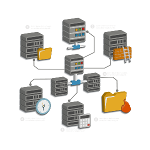

# 3️⃣ Gestión de Dominios y Servicios de Directorio

{align="right"}
La **gestión de dominios y servicios de directorio** es una parte fundamental de la administración de redes en entornos empresariales. Los dominios permiten centralizar la gestión de usuarios, equipos, políticas y recursos. El servicio de directorio en Windows Server se denomina **Active Directory (AD)**, y es la herramienta principal que se utiliza para organizar y administrar estos elementos en una red.

---

### **3.1. Conceptos Fundamentales de Dominios y Servicios de Directorio**

#### **Dominios**
Un **dominio** es un área de la red que agrupa un conjunto de objetos, tales como usuarios, equipos y recursos, administrados de manera centralizada. Dentro de un dominio, todos los recursos pueden autenticarse y autorizarse en función de políticas establecidas.

- **Controlador de Dominio (DC)**: Servidor que almacena la base de datos de Active Directory y gestiona el inicio de sesión y la autenticación de los usuarios.
- **Árbol y Bosque**: Cuando se crean múltiples dominios, pueden organizarse en una jerarquía conocida como árbol. Un conjunto de árboles, a su vez, se organiza en un bosque.

#### **📂 Active Directory (AD)**
**Active Directory (AD)** es el servicio de directorio que ofrece Microsoft para almacenar y administrar información sobre los objetos de una red. AD proporciona un entorno de autenticación y autorización, lo que permite que los administradores gestionen usuarios y recursos centralizadamente.

**Objetos principales en Active Directory**:
- **Usuarios y Grupos**: Objetos que representan personas o colectivos en la red.
- **Equipos**: Cada equipo en el dominio tiene su propia cuenta en AD.
- **Unidades Organizativas (OU)**: Carpetas virtuales donde se organizan los objetos de AD para una administración lógica y eficiente.

### **3.2. Instalación y Configuración del Servicio de Directorio**

Para gestionar dominios en una red Windows Server, el primer paso es instalar y configurar el **Active Directory Domain Services (AD DS)**, que permite convertir un servidor en un controlador de dominio.

#### **Instalación de AD DS en Windows Server**
1. **Abrir el Administrador del Servidor**: Iniciar sesión en el servidor y abrir el Administrador del Servidor.
2. **Agregar rol de AD DS**:
   - Haz clic en **Agregar roles y características**.
   - Selecciona **Servicios de dominio de Active Directory (AD DS)** y sigue el asistente.
3. **Promover el servidor a controlador de dominio**:
   - Una vez instalado el rol, selecciona **Promover este servidor a controlador de dominio**.
   - Configura el **nombre del dominio**, crea una nueva **unidad organizativa (OU)** si es necesario y establece las políticas de **DNS** y **Directivas de seguridad**.
   - Reinicia el servidor para aplicar los cambios.

**Resultado**: El servidor ahora actúa como un controlador de dominio (DC), con AD DS configurado para gestionar la red.

### **3.3. Estructura del Servicio de Directorio y sus Elementos**

#### **Unidades Organizativas (OU)**
Las **OU** son estructuras jerárquicas en Active Directory que permiten organizar los objetos, tales como usuarios, grupos y equipos. 

- Las **OU** facilitan la delegación de administración, lo que permite asignar permisos a un grupo específico de administradores para que gestionen únicamente los objetos en su OU.
- **Ejemplo práctico**: Una empresa puede crear una OU para cada departamento (Ventas, Soporte, IT) y delegar la administración de los usuarios y recursos de cada departamento a un administrador específico.

#### **Árboles y Bosques**
Los **árboles** y **bosques** permiten escalar la red con múltiples dominios. Un **árbol** es una colección de uno o más dominios con una relación jerárquica. Un **bosque** es un grupo de árboles que comparten una base de datos de directorio común y políticas de seguridad.

- **Ejemplo práctico**: Una multinacional con sedes en diferentes países puede crear un bosque con un dominio para cada país y árboles que representan cada departamento.

### **3.4. Configuración de Relaciones de Confianza entre Dominios**

Las **relaciones de confianza** permiten que los usuarios en un dominio accedan a los recursos de otro dominio dentro del mismo bosque o de un bosque diferente.

#### **Tipos de Relaciones de Confianza**
- **Confianza entre dominios**: Una relación entre dos dominios dentro del mismo bosque.
- **Confianza entre bosques**: Una relación que permite que los usuarios de diferentes bosques accedan a recursos en otros bosques.
- **Confianza transitiva**: Permite que la confianza se extienda automáticamente a través de múltiples dominios.

!!!warning "**Ejemplo de configuración de relaciones de confianza**"
    1. Abre **Usuarios y Equipos de Active Directory** en el controlador de dominio.
    2. Ve a **Propiedades** del dominio y selecciona la pestaña **Confianza**.
    3. Selecciona **Nueva relación de confianza** y sigue el asistente para establecer la relación entre dominios o bosques.

**Resultado**: Ahora, los usuarios de un dominio pueden acceder a los recursos en otro dominio según los permisos asignados.

### **3.5. Administración de Dominios y Políticas de Seguridad**

La **consola de administración de directivas de grupo (GPMC)** permite aplicar políticas de seguridad en toda la red o en OUs específicas. Estas políticas controlan el acceso, configuraciones de red, directivas de seguridad, y más.

#### **Aplicación de Políticas de Grupo (GPO)**
Las **GPOs** son políticas que aplican configuraciones a usuarios y equipos dentro de Active Directory. Se pueden crear políticas para gestionar aspectos como la configuración de escritorio, restricciones de acceso y políticas de seguridad.

##### **Ejemplo: Configuración de una GPO para restricción de aplicaciones**
1. Abre **Administración de directivas de grupo (GPMC)**.
2. Crea una nueva **Directiva de Grupo (GPO)** en la OU donde se encuentra el grupo de usuarios deseado.
3. Configura las políticas de **Restricción de software** en la GPO, estableciendo las aplicaciones permitidas.
4. Aplica la GPO a la OU.

**Resultado**: Los usuarios de esa OU solo podrán ejecutar las aplicaciones permitidas, mejorando la seguridad del entorno.

### **3.6. Herramientas de Administración de Dominios**

En Windows Server existen diversas herramientas para la administración de dominios:

- **Usuarios y Equipos de Active Directory**: Administra usuarios, equipos y grupos en el dominio.
- **Dominios y Confianzas de Active Directory**: Configura relaciones de confianza entre dominios y bosques.
- **Sitios y Servicios de Active Directory**: Administra la replicación entre controladores de dominio.
- **Administración de directivas de grupo (GPMC)**: Configura y aplica políticas de grupo (GPOs).

!!!tip "**Ejemplo práctico**"
    Un administrador puede utilizar la GPMC para crear una política que bloquee el acceso a ciertos paneles de configuración de Windows a los usuarios no administradores en una OU específica.

### **3.7. Ejercicio Práctico de Aplicación**

#### **Actividad práctica: Configuración de un Dominio y Aplicación de Políticas de Grupo**

**Objetivo**: Crear una estructura de dominio, configurar relaciones de confianza y aplicar políticas de grupo.

**Pasos**:
1. **Crear un Dominio**:
   - Instalar **AD DS** y configurar el dominio en VirtualBox, siguiendo los pasos de la sección de instalación.
2. **Configurar una OU** para cada departamento de una empresa (por ejemplo, Ventas y Soporte).
3. **Crear usuarios y grupos** en cada OU según el rol de cada empleado en el departamento.
4. **Configurar una política de grupo** para restringir el acceso al panel de control y a las configuraciones de red para todos los usuarios del departamento de Soporte.
5. **Establecer una relación de confianza** con otro dominio o bosque creado en un entorno de laboratorio.

**Resultado esperado**: Habréis configurado un dominio, organizado usuarios y grupos en OUs, aplicado una GPO y establecido relaciones de confianza entre dominios. 

!!!note "Conclusión"
    La gestión de **dominios y servicios de directorio** en Windows Server permite crear un entorno centralizado de administración que facilita el control de usuarios, equipos y recursos. Con el uso de **Active Directory**, los administradores pueden aplicar políticas de seguridad de manera global, estableciendo relaciones de confianza para la colaboración entre dominios y optimizando la estructura de la red. Con el conocimiento adquirido en este tema, ahora estaréis preparados para gestionar redes complejas de manera eficiente.